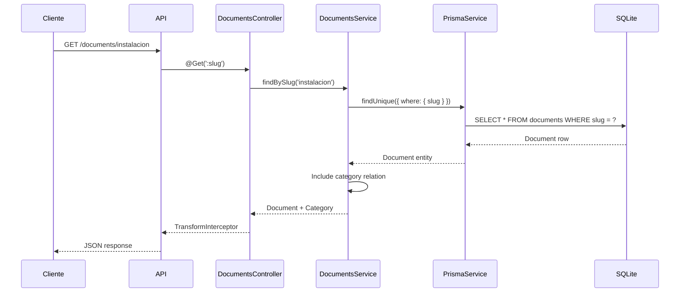
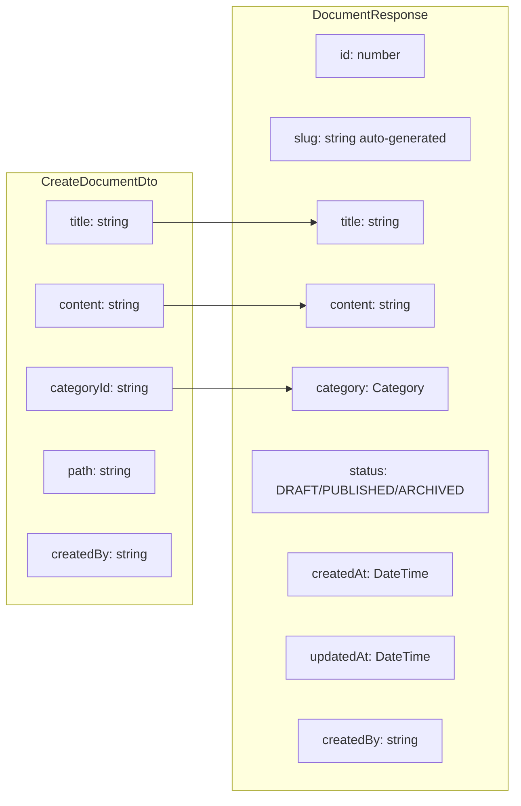
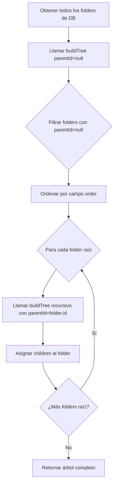
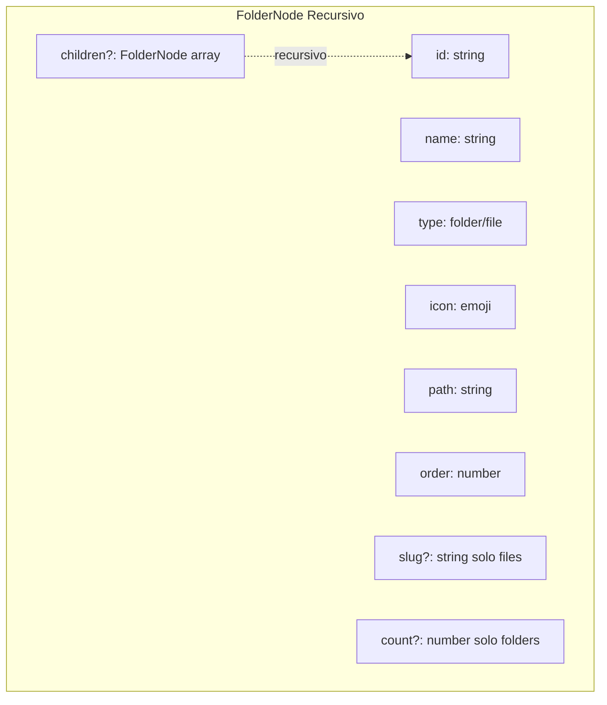
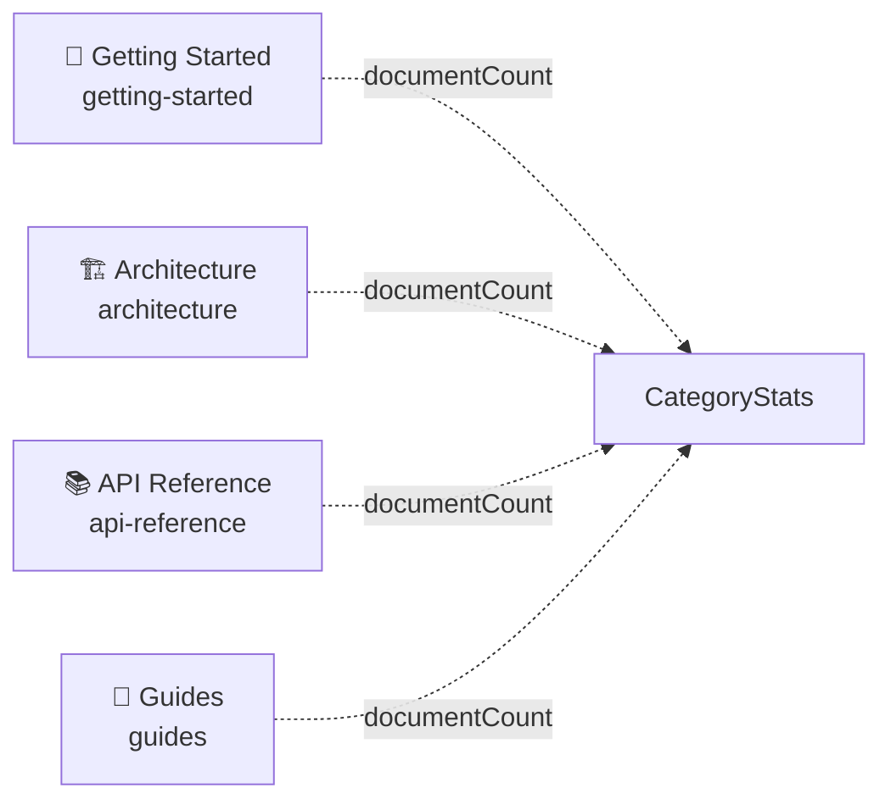
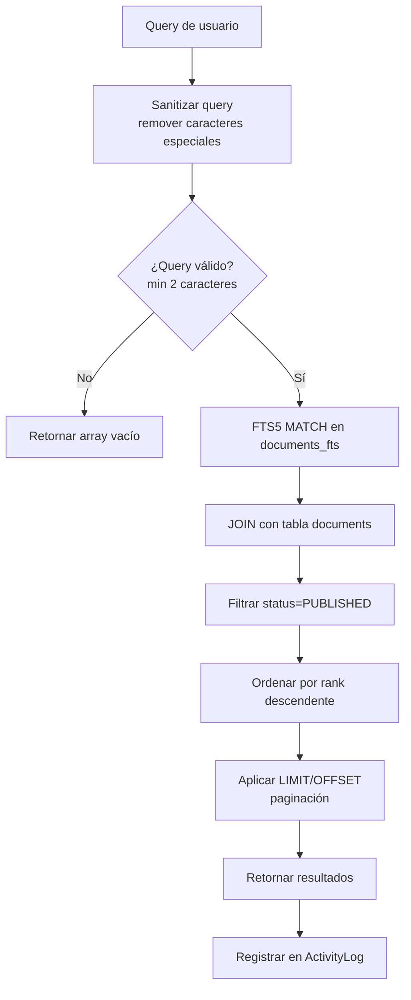
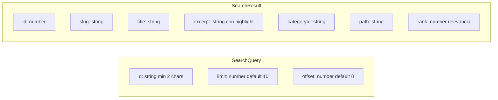
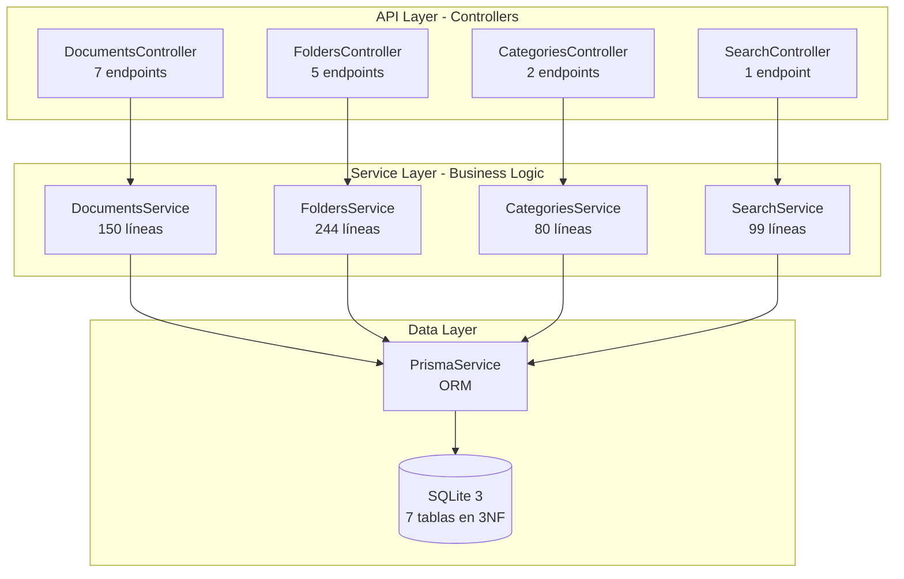
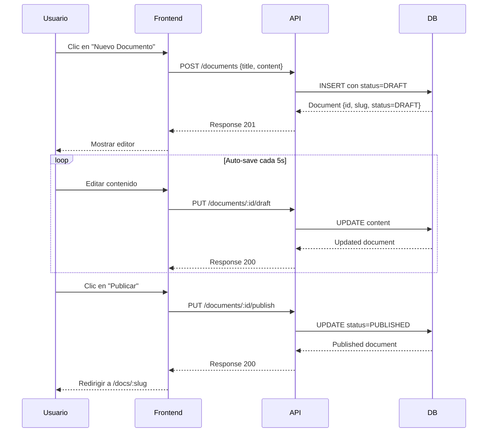
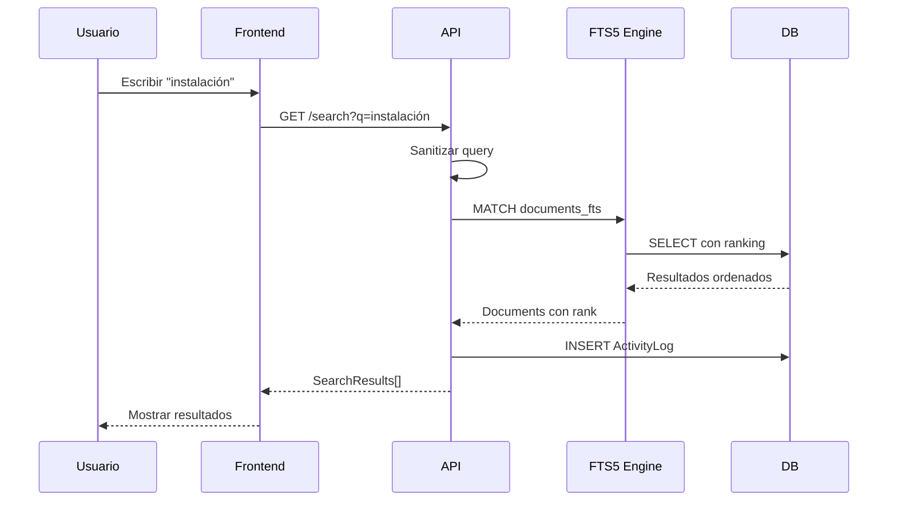

# 📡 API Reference

**Base URL**: `http://localhost:3000`  
**Versión**: v0.5  
**Última actualización**: Noviembre 2025

---

## 🔧 CONFIGURACIÓN

### Variables de Entorno

**Backend (.env)**
- `API_HOST`: localhost:3000
- `API_BASE_URL`: http://localhost:3000
- `UPLOAD_BASE_URL`: /uploads
- `FRONTEND_URL`: http://localhost:4321

**Producción**
- `API_HOST`: api.ailurus.dev
- `API_BASE_URL`: https://api.ailurus.dev
- `UPLOAD_BASE_URL`: https://cdn.ailurus.dev
- `FRONTEND_URL`: https://ailurus.dev

---

## 📋 VISIÓN GENERAL

Documentación completa de endpoints REST del backend NestJS.

**Características:**
- ✅ Sin prefijo `/api` (endpoints directos)
- ✅ Rate limiting aplicado globalmente
- ✅ Validación de DTOs con `class-validator`
- ✅ Respuestas estandarizadas con `TransformInterceptor`
- ✅ CORS habilitado para `http://localhost:4321`

**Arquitectura:**
- 5 módulos NestJS: Documents, Folders, Categories, Search, Prisma
- 21 endpoints implementados
- SQLite 3 con FTS5 para búsqueda full-text

---

## 🔧 FORMATO DE RESPUESTA

### Respuesta Exitosa

```json
{
  "success": true,
  "data": { },
  "timestamp": "2025-11-21T19:00:00.000Z"
}
```

### Respuesta de Error

```json
{
  "success": false,
  "statusCode": 400,
  "message": "Error message or validation errors array",
  "timestamp": "2025-11-21T19:00:00.000Z",
  "path": "/docs",
  "method": "POST"
}
```

---

## 📄 DOCUMENTS MODULE

**Implementación**: `backend/src/modules/documents/`
- Controller: `documents.controller.ts`
- Service: `documents.service.ts` (150 líneas)
- DTOs: `dto/create-document.dto.ts`, `dto/update-document.dto.ts`

### Endpoints Disponibles

| Método | Ruta | Descripción |
|--------|------|-------------|
| GET | `/documents` | Listar documentos publicados |
| GET | `/documents/:slug` | Obtener documento por slug |
| GET | `/documents?category=:id` | Filtrar por categoría |
| POST | `/documents` | Crear documento (draft) |
| PUT | `/documents/:id/draft` | Actualizar draft (auto-save) |
| PUT | `/documents/:id/publish` | Publicar documento |
| DELETE | `/documents/:id` | Archivar documento (soft delete) |

### Flujo de Request



### Estructura de Datos



### Manejo de Errores

**400 Bad Request**
- Datos inválidos (validación de class-validator)
- Slug duplicado al crear documento
- Contenido vacío al intentar publicar

**404 Not Found**
- Documento no encontrado por slug o ID
- Documento en estado draft/archived al buscar por slug

**500 Internal Server Error**
- Error de base de datos
- Error inesperado del servidor

---

## 🗂️ FOLDERS MODULE

**Implementación**: `backend/src/modules/folders/`
- Controller: `folders.controller.ts`
- Service: `folders.service.ts` (244 líneas)
- DTOs: `dto/folder-node-response.dto.ts`

### Endpoints Disponibles

| Método | Ruta | Descripción |
|--------|------|-------------|
| GET | `/folders` | Obtener árbol completo (recursivo) |
| GET | `/folders/:path` | Obtener nodo por path con children |
| POST | `/folders` | Crear folder (valida path único) |
| PUT | `/folders/:id` | Actualizar folder |
| DELETE | `/folders/:id` | Eliminar folder (valida sin children) |

### Algoritmo BuildTree



### Estructura de Datos



**Características:**
- Árbol jerárquico con recursividad ilimitada
- 29 nodos totales: 9 folders + 20 files
- Paths estilo Obsidian: `"Equipo/Proyecto/Getting Started/Instalación"`

---

## 📚 CATEGORIES MODULE

**Implementación**: `backend/src/modules/categories/`
- Controller: `categories.controller.ts`
- Service: `categories.service.ts` (~80 líneas)

### Endpoints Disponibles

| Método | Ruta | Descripción |
|--------|------|-------------|
| GET | `/categories` | Listar 4 categorías fijas con stats |
| GET | `/categories/:id` | Obtener categoría con estadísticas |

### Categorías Fijas



**Características:**
- 4 categorías fijas (no se pueden crear más)
- `documentCount` pre-calculado desde tabla `CategoryStats`
- Ordenadas por campo `order`

---

## 🔍 SEARCH MODULE

**Implementación**: `backend/src/modules/search/`
- Controller: `search.controller.ts`
- Service: `search.service.ts` (99 líneas)

### Endpoints Disponibles

| Método | Ruta | Descripción |
|--------|------|-------------|
| GET | `/search?q=:query&limit=:limit&offset=:offset` | Búsqueda FTS5 con ranking |

### Flujo de Búsqueda FTS5



### Estructura de Datos



**Características:**
- SQLite FTS5 con tokenizer unicode61
- Sanitización de queries para prevenir errores FTS5
- Ranking por relevancia (campo `rank`)
- Solo busca en documentos PUBLISHED
- Logging de búsquedas en `ActivityLog`

---

## 📊 ARQUITECTURA DE MÓDULOS



---

## ⚡ RATE LIMITING

### Límites Globales

| Ventana | Límite | Descripción |
|---------|--------|-------------|
| 1 segundo | 10 requests | Burst protection |
| 10 segundos | 50 requests | Uso normal |
| 1 minuto | 100 requests | Límite general |

**Response 429 (Too Many Requests)**
```json
{
  "statusCode": 429,
  "message": "Too many requests. Please try again later."
}
```

---

## 🔐 AUTENTICACIÓN

**POC v0.1**: Sin autenticación, endpoints públicos

**v0.5+**: JWT authentication con header `Authorization: Bearer {token}`

---

## 📝 EJEMPLOS DE FLUJOS

### Flujo: Crear y Publicar Documento



### Flujo: Búsqueda



---

## 📚 REFERENCIAS

- **Implementación completa**: `backend/src/modules/`
- **Schema Prisma**: `backend/prisma/schema.prisma`
- **DTOs**: `backend/src/modules/*/dto/`
- **Tests**: `backend/src/modules/*/*.spec.ts`

**Siguiente**: Ver [Backend Architecture](./BACKEND_ARCHITECTURE.md) para detalles de implementación.
