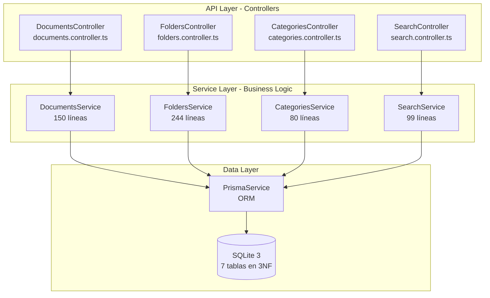
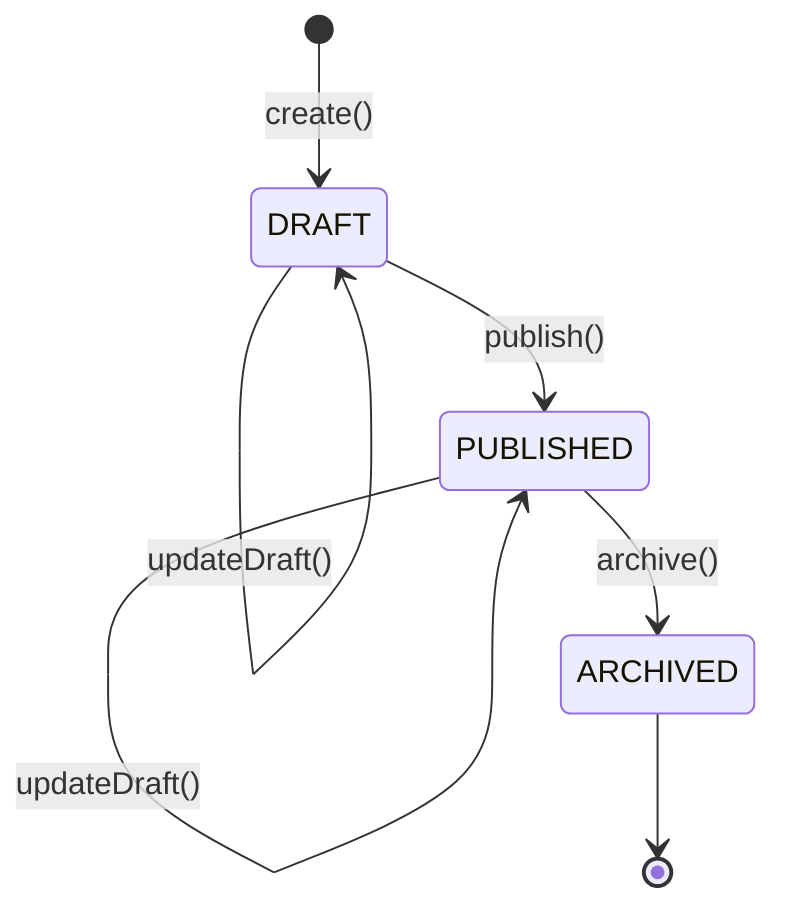
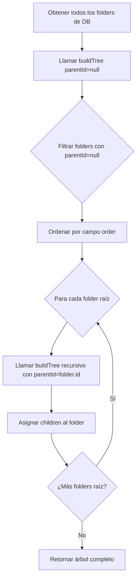
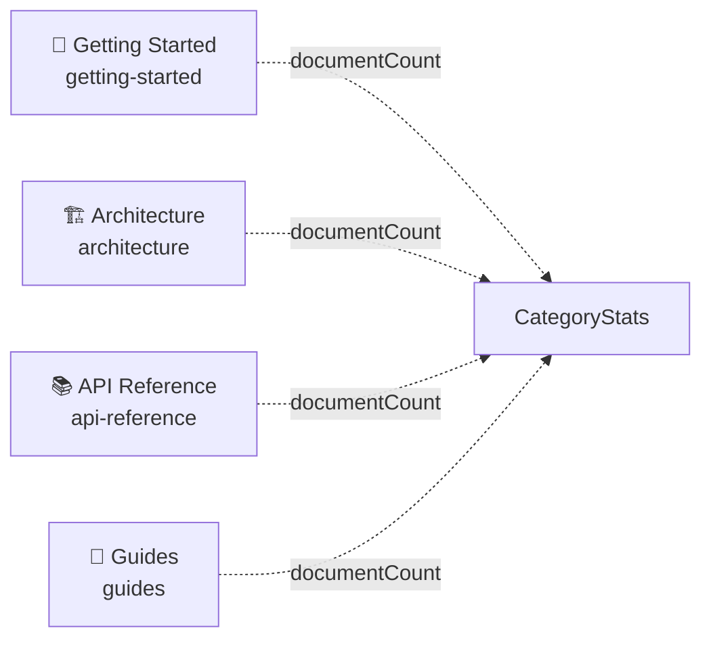
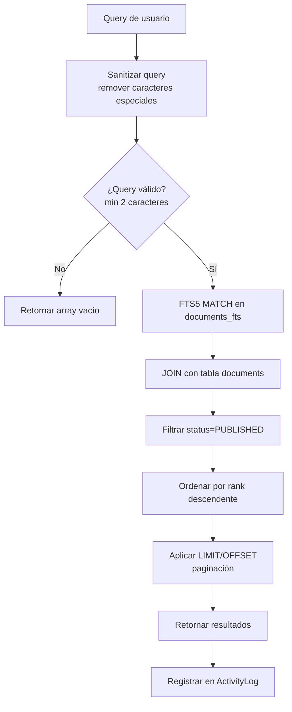

# 🚀 Backend Implementation Plan - NestJS

**Framework**: NestJS 11.x + Prisma 7.0.0 + SQLite 3  
**Versión**: v0.5  
**Última actualización**: Noviembre 2025

---

## 📊 ESTADO ACTUAL

### Completado (70%)

- ✅ Proyecto NestJS inicializado
- ✅ Prisma configurado con SQLite + BetterSQLite3 adapter
- ✅ Schema Prisma definido (7 tablas, 3NF)
- ✅ 5 módulos NestJS implementados
- ✅ 21 archivos TypeScript
- ✅ Database poblada con seed data
- ✅ FTS5 full-text search operacional

### Pendiente (30%)

- ⏳ Migrar frontend de mocks a API real
- ⏳ Testing E2E automatizado
- ⏳ Documentación de API con Swagger
- ⏳ Deploy y configuración de producción

---

## 🏗️ ARQUITECTURA DE MÓDULOS

**Implementación**: `backend/src/modules/`



---

## 📦 ESTADO DE MÓDULOS

### Tabla de Implementación

| Módulo | Estado | Archivo Principal | Líneas | Métodos Clave |
|--------|--------|-------------------|--------|---------------|
| Documents | ✅ 100% | `documents.service.ts` | 150 | findAll, findBySlug, create, updateDraft, publish, archive |
| Folders | ✅ 100% | `folders.service.ts` | 244 | findAll, buildTree, findByPath, create, update, delete |
| Categories | ✅ 100% | `categories.service.ts` | ~80 | findAll, findById, getStats |
| Search | ✅ 100% | `search.service.ts` | 99 | search (FTS5), logSearch, sanitizeQuery |
| Prisma | ✅ 100% | `prisma.service.ts` | ~50 | onModuleInit, onModuleDestroy, $connect, $disconnect |

---

## 🔧 MÓDULO DOCUMENTS

**Implementación**: `backend/src/modules/documents/`

### Archivos

- Controller: `documents.controller.ts`
- Service: `documents.service.ts` (150 líneas)
- DTOs: `dto/create-document.dto.ts`, `dto/update-document.dto.ts`

### Funcionalidades Clave

**Slug Generation**:
- Normalización de texto (lowercase)
- Remoción de acentos (NFD + regex)
- Reemplazo de caracteres especiales por guiones
- Validación de unicidad

**Status Workflow**:


**Validaciones**:
- Title: máximo 200 caracteres
- Content: requerido para publicar
- CategoryId: debe existir en tabla Category
- Slug: único en la base de datos

---

## 🗂️ MÓDULO FOLDERS

**Implementación**: `backend/src/modules/folders/`

### Archivos

- Controller: `folders.controller.ts`
- Service: `folders.service.ts` (244 líneas)
- DTOs: `dto/folder-node-response.dto.ts`

### Algoritmo BuildTree



**Características**:
- Recursividad ilimitada
- 29 nodos totales: 9 folders + 20 files
- Paths estilo Obsidian: `"Equipo/Proyecto/Getting Started/Instalación"`
- Validación de paths únicos
- Validación de eliminación (no permite eliminar folders con children)

---

## 📚 MÓDULO CATEGORIES

**Implementación**: `backend/src/modules/categories/`

### Archivos

- Controller: `categories.controller.ts`
- Service: `categories.service.ts` (~80 líneas)

### Categorías Fijas



**Funcionalidades**:
- 4 categorías fijas (no se pueden crear más)
- `documentCount` pre-calculado desde tabla `CategoryStats`
- Ordenadas por campo `order`

---

## 🔍 MÓDULO SEARCH

**Implementación**: `backend/src/modules/search/`

### Archivos

- Controller: `search.controller.ts`
- Service: `search.service.ts` (99 líneas)

### Flujo de Búsqueda FTS5



**Características**:
- SQLite FTS5 con tokenizer unicode61
- Sanitización de queries para prevenir errores FTS5
- Ranking por relevancia (campo `rank`)
- Solo busca en documentos PUBLISHED
- Logging de búsquedas en `ActivityLog`

---

## 🔧 INFRAESTRUCTURA GLOBAL

### Configuración en main.ts

**CORS**:
- Origin: `http://localhost:4321`
- Credentials: true

**Validation Pipe**:
- Whitelist: true (remueve propiedades no definidas en DTOs)
- Transform: true (transforma tipos automáticamente)
- ForbidNonWhitelisted: true (rechaza propiedades desconocidas)

**Rate Limiting**:
- 10 requests por segundo (burst protection)
- 50 requests por 10 segundos (uso normal)
- 100 requests por minuto (límite general)

---

## 📁 ESTRUCTURA DE CARPETAS

```
backend/
├── prisma/
│   ├── schema.prisma          # Schema de 7 tablas
│   ├── seed.ts                # Seed con 20 documentos
│   └── migrations/            # Migraciones SQL
├── src/
│   ├── main.ts                # Bootstrap de NestJS
│   ├── app.module.ts          # Módulo raíz
│   │
│   └── modules/
│       ├── documents/
│       │   ├── documents.module.ts
│       │   ├── documents.controller.ts
│       │   ├── documents.service.ts
│       │   └── dto/
│       │
│       ├── folders/
│       │   ├── folders.module.ts
│       │   ├── folders.controller.ts
│       │   ├── folders.service.ts
│       │   └── dto/
│       │
│       ├── categories/
│       │   ├── categories.module.ts
│       │   ├── categories.controller.ts
│       │   └── categories.service.ts
│       │
│       ├── search/
│       │   ├── search.module.ts
│       │   ├── search.controller.ts
│       │   └── search.service.ts
│       │
│       └── prisma/
│           ├── prisma.module.ts
│           └── prisma.service.ts
│
└── test/
    └── e2e/
```

---

## 🧪 TESTING

**Framework**: Jest (configurado pero no implementado en POC)

**Estrategia futura**:
- Unit tests para services
- Integration tests para controllers
- E2E tests para flujos completos

---

## 🚀 DEPLOYMENT

### Build para Producción

```bash
pnpm build
```

Genera `dist/` con código compilado.

### Variables de Entorno

```env
DATABASE_URL="file:./dev.db"
NODE_ENV=production
PORT=3000
CORS_ORIGIN=https://ailurus.dev
```

---

## 📚 REFERENCIAS

- **Módulos**: `backend/src/modules/`
- **Schema Prisma**: `backend/prisma/schema.prisma`
- **Seed**: `backend/prisma/seed.ts`
- **DTOs**: `backend/src/modules/*/dto/`

**Siguiente**: Ver [Frontend Migration Plan](./FRONTEND_MIGRATION_PLAN.md) para integración con API.
