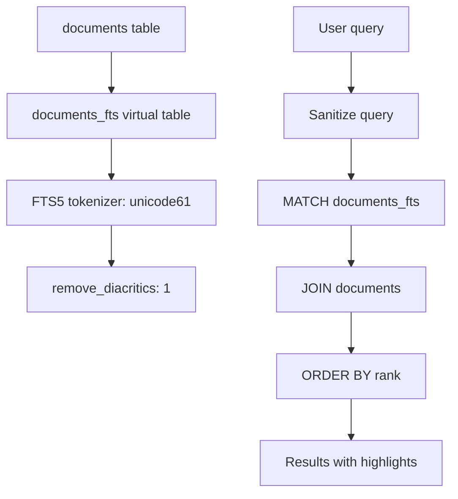
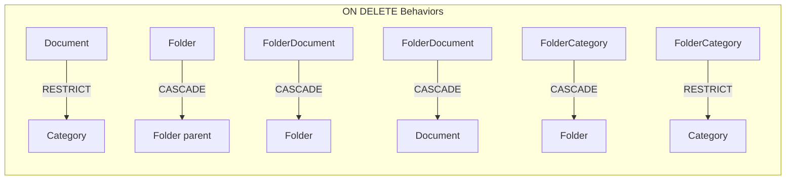
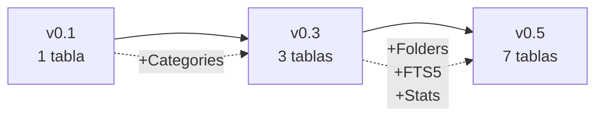

# 🗄️ Database Schema - SQLite + Prisma

**Database**: SQLite 3  
**ORM**: Prisma 7.0.0  
**Normalization**: Third Normal Form (3NF)  
**Versión**: v0.5  
**Última actualización**: Noviembre 2025

---

## 📋 VISIÓN GENERAL

El schema de Ailurus está diseñado siguiendo principios de **Tercera Forma Normal (3NF)** para garantizar integridad de datos, escalabilidad y performance óptimo.

**¿Por qué SQLite?**
- ✅ Portabilidad: Un solo archivo `.db` fácil de respaldar
- ✅ Docker-friendly: Persistencia simple con volúmenes
- ✅ Zero-config: Sin servidor de DB separado
- ✅ Suficiente: Soporta miles de documentos
- ✅ FTS5: Full-text search integrado

**Características del schema**:
- ✅ 3NF compliant: Sin dependencias transitivas
- ✅ Integridad referencial: Foreign keys con ON DELETE configuradas
- ✅ Índices estratégicos: Optimización de queries frecuentes
- ✅ Enums tipados: DocumentStatus, FolderType
- ✅ Self-referential: Jerarquía ilimitada de folders
- ✅ Many-to-Many: Documentos en múltiples folders

---

## 📊 DIAGRAMA DE RELACIONES

```mermaid
erDiagram
    Category ||--o{ Document : "has many"
    Category ||--o{ FolderCategory : "has many"
    Category ||--|| CategoryStats : "has one"
    
    Document ||--o{ FolderDocument : "appears in"
    Document {
        int id PK
        string slug UK
        string title
        text content
        string excerpt
        string categoryId FK
        string subcategory
        string path
        enum status
        datetime createdAt
        datetime updatedAt
        string createdBy
    }
    
    Folder ||--o{ Folder : "parent of"
    Folder ||--o{ FolderDocument : "contains"
    Folder ||--o{ FolderCategory : "belongs to"
    Folder {
        int id PK
        string name
        enum type
        string icon
        string path UK
        int order
        int parentId FK
    }
    
    Category {
        string id PK
        string name
        string icon
        int order
    }
    
    FolderDocument {
        int folderId PK_FK
        int documentId PK_FK
        int order
    }
    
    FolderCategory {
        int folderId PK_FK
        string categoryId PK_FK
    }
    
    CategoryStats {
        string categoryId PK_FK
        int totalDocs
        int publishedDocs
        int draftDocs
        int archivedDocs
        datetime lastUpdated
    }
    
    ActivityLog {
        int id PK
        string entityType
        int entityId
        string action
        string userId
        json changes
        string ipAddress
        string userAgent
        datetime createdAt
    }
```

---

## 📐 ENTIDADES PRINCIPALES

### Tabla de Entidades

| Entidad | Tipo | Descripción | Registros Actuales |
|---------|------|-------------|-------------------|
| Document | Principal | Documentos Markdown | 20 |
| Category | Principal | Categorías fijas | 4 |
| Folder | Principal | Jerarquía de navegación | 29 (9 folders + 20 files) |
| FolderDocument | Unión M:M | Documentos en folders | Variable |
| FolderCategory | Unión M:M | Folders en categorías | Variable |
| CategoryStats | Auxiliar | Estadísticas pre-calculadas | 4 |
| ActivityLog | Auxiliar | Auditoría de acciones | Variable |

---

## 🔍 BÚSQUEDA FTS5

### Patrón de Implementación



**Características**:
- Virtual table `documents_fts` con FTS5
- Tokenizer unicode61 con remoción de diacríticos
- Indexa campos: `title`, `content`, `excerpt`
- Ranking por relevancia automático
- Highlights de términos de búsqueda

**Implementación**: `backend/prisma/migrations/*/migration.sql`

---

## 🔐 INTEGRIDAD REFERENCIAL

### Configuraciones de Foreign Keys



**Reglas**:
- **RESTRICT**: No se puede borrar si tiene dependencias
- **CASCADE**: Borra automáticamente dependencias

---

## 📈 ÍNDICES ESTRATÉGICOS

### Tabla de Índices

| Tabla | Columna(s) | Tipo | Justificación |
|-------|-----------|------|---------------|
| Document | `categoryId` | B-tree | Filtrado por categoría (muy frecuente) |
| Document | `status` | B-tree | Filtrado publicados vs drafts |
| Document | `path` | B-tree | Búsquedas jerárquicas |
| Document | `createdAt` | B-tree | Ordenamiento temporal |
| Folder | `parentId` | B-tree | Construcción de árbol |
| Folder | `path` | B-tree | Lookup directo por ruta |
| ActivityLog | `(entityType, entityId)` | Composite | Auditoría por entidad |
| ActivityLog | `userId` | B-tree | Actividad por usuario |

---

## 🌱 SEED DATA

**Implementación**: `backend/prisma/seed.ts`

### Datos Iniciales

- ✅ 4 categorías con iconos y orden
- ✅ 20 documentos basados en `frontend/src/mocks/documents.mock.ts`
- ✅ 29 nodos en árbol jerárquico (9 folders + 20 files)
- ✅ FolderDocument links conectando documentos a folders
- ✅ CategoryStats con conteos iniciales

**Ejecutar seed**:
```bash
cd backend
pnpm prisma:seed
```

**Verificar datos**:
```bash
pnpm prisma:studio
# Abre http://localhost:5555
```

---

## ⚙️ COMANDOS PRISMA

### Comandos Principales

| Comando | Descripción |
|---------|-------------|
| `pnpm prisma:generate` | Genera cliente TypeScript |
| `pnpm prisma:migrate` | Crea y aplica migración |
| `pnpm prisma:studio` | Abre GUI para explorar datos |
| `pnpm db:reset` | ⚠️ Borra DB, reaplica migrations, ejecuta seed |
| `npx prisma migrate status` | Ver migraciones aplicadas |

---

## 🔄 EVOLUCIÓN DEL SCHEMA

### Cambios Clave

**Versión Inicial (POC v0.1)**:
- 1 tabla simple (Document)
- Sin categorías
- Sin jerarquía
- Sin búsqueda

**Versión Actual (v0.5)**:
- 7 tablas (normalización 3NF)
- Sistema de categorías completo
- Folders self-referential
- FTS5 integrado



---

## 📚 REFERENCIAS

- **Schema Prisma**: `backend/prisma/schema.prisma`
- **Seed**: `backend/prisma/seed.ts`
- **Migraciones**: `backend/prisma/migrations/`

**Siguiente**: Ver [Folder System](./FOLDER_SYSTEM.md) para detalles de jerarquía.
