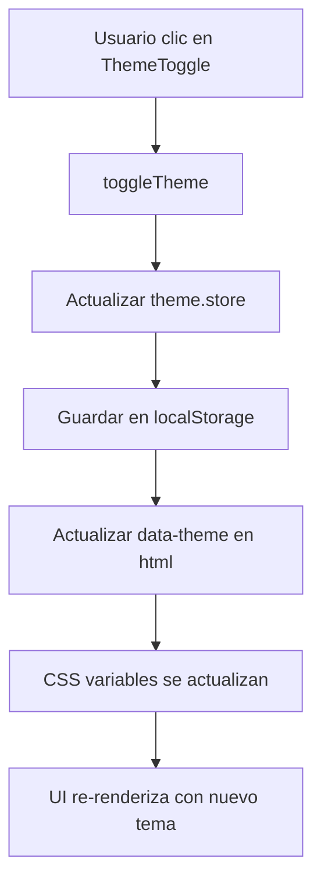
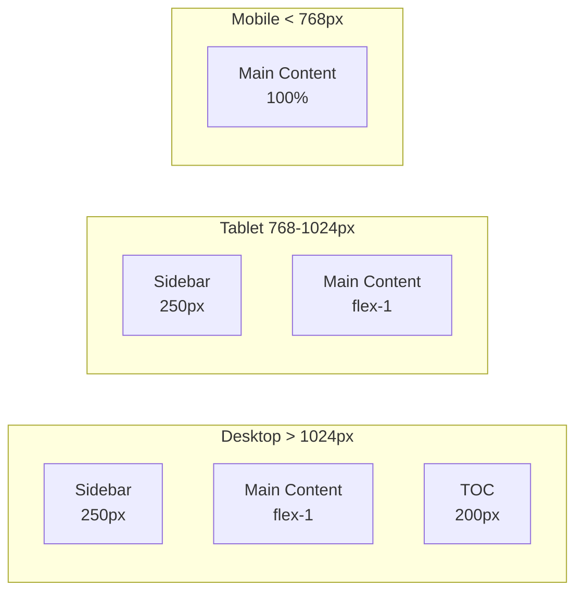

# 🎨 Design System - shadcn/ui + Tailwind CSS

**Framework**: shadcn/ui + Tailwind CSS  
**Versión**: v0.5  
**Última actualización**: Noviembre 2025

---

## 📋 VISIÓN GENERAL

El design system de Ailurus está construido sobre **shadcn/ui**, una colección de componentes accesibles y customizables construidos con Radix UI y Tailwind CSS.

**Características**:
- ✅ 15 componentes shadcn/ui instalados
- ✅ Temas light/dark con CSS variables
- ✅ Accesibilidad WCAG 2.2 AA
- ✅ Responsive design mobile-first
- ✅ Tipografía optimizada para legibilidad

---

## 📦 COMPONENTES SHADCN/UI

### Tabla de Componentes Instalados (15)

| Componente | Ubicación | Uso Principal |
|------------|-----------|---------------|
| Badge | `components/ui/badge.tsx` | Etiquetas de categorías |
| Button | `components/ui/button.tsx` | Acciones principales |
| Card | `components/ui/card.tsx` | Cards de documentos |
| Dialog | `components/ui/dialog.tsx` | Modales (lightbox, forms) |
| Dropdown Menu | `components/ui/dropdown-menu.tsx` | Menús contextuales |
| Input | `components/ui/input.tsx` | Campos de formulario |
| Label | `components/ui/label.tsx` | Labels accesibles |
| Select | `components/ui/select.tsx` | Selectores |
| Separator | `components/ui/separator.tsx` | Separadores visuales |
| Skeleton | `components/ui/skeleton.tsx` | Loading states |
| Tabs | `components/ui/tabs.tsx` | Pestañas |
| Textarea | `components/ui/textarea.tsx` | Editor de texto |
| Toast | `components/ui/toast.tsx` | Notificaciones |
| Toaster | `components/ui/toaster.tsx` | Contenedor de toasts |
| Tooltip | `components/ui/tooltip.tsx` | Tooltips informativos |

**Implementación**: `frontend/src/components/ui/`

---

## 🎨 SISTEMA DE COLORES

### CSS Variables

```css
:root {
  --background: 0 0% 100%;
  --foreground: 222.2 84% 4.9%;
  
  --primary: 222.2 47.4% 11.2%;
  --primary-foreground: 210 40% 98%;
  
  --ailurus-orange: 24 100% 50%;
  --ailurus-red: 4 90% 58%;
  
  --border: 214.3 31.8% 91.4%;
  --input: 214.3 31.8% 91.4%;
  --ring: 222.2 84% 4.9%;
}

.dark {
  --background: 222.2 84% 4.9%;
  --foreground: 210 40% 98%;
  
  --primary: 210 40% 98%;
  --primary-foreground: 222.2 47.4% 11.2%;
  
  --border: 217.2 32.6% 17.5%;
  --input: 217.2 32.6% 17.5%;
  --ring: 212.7 26.8% 83.9%;
}
```

### Colores Principales

| Color | Hex | Uso |
|-------|-----|-----|
| Ailurus Orange | `#FF9800` | Color principal, acentos |
| Ailurus Red | `#E74C3C` | Color secundario, alertas |
| Background | Variable | Fondo principal (light/dark) |
| Foreground | Variable | Texto principal (light/dark) |
| Border | Variable | Bordes y separadores |

---

## 🖋️ TIPOGRAFÍA

### Fuentes

**Sans-serif**: Inter Variable
- Uso: Texto general, UI
- Peso: 400 (regular), 500 (medium), 600 (semibold), 700 (bold)

**Monospace**: Fira Code
- Uso: Código, snippets
- Peso: 400 (regular), 500 (medium)

### Escala Tipográfica

| Clase | Tamaño | Uso |
|-------|--------|-----|
| `text-xs` | 0.75rem | Metadatos, timestamps |
| `text-sm` | 0.875rem | Texto secundario |
| `text-base` | 1rem | Texto principal |
| `text-lg` | 1.125rem | Subtítulos |
| `text-xl` | 1.25rem | Títulos de sección |
| `text-2xl` | 1.5rem | Títulos de página |
| `text-3xl` | 1.875rem | Títulos principales |

---

## 🎭 SISTEMA DE TEMAS

### Implementación

**Store**: `frontend/src/shared/stores/theme.store.ts`



**Características**:
- Persistencia en localStorage
- Detección de preferencia del sistema
- Transiciones suaves entre temas
- Soporte completo light/dark

---

## 🎨 ICONOS

### Sistema de Iconos

**Emojis** (8 iconos principales):
- 👥 Equipo
- 📦 Proyecto
- 🚀 Getting Started
- 🏗️ Architecture
- 📚 API Reference
- 📖 Guides
- 👣 Primeros Pasos
- ⚙️ Configuración

**Lucide React** (iconos UI):
- Folder, FolderOpen, File (navegación)
- Search, X, Menu (acciones)
- ChevronRight, ChevronDown (expansión)
- Sun, Moon (tema)
- Copy, Check (código)

**Implementación**: `lucide-react` package

---

## 📱 RESPONSIVE DESIGN

### Breakpoints

```css
/* Tailwind CSS breakpoints */
sm: 640px   /* Tablet pequeña */
md: 768px   /* Tablet */
lg: 1024px  /* Desktop */
xl: 1280px  /* Desktop grande */
2xl: 1536px /* Desktop extra grande */
```

### Grid Layout



---

## ♿ ACCESIBILIDAD

### Características WCAG 2.2 AA

- ✅ Contrast ratio: 4.5:1 mínimo
- ✅ Focus visible: Outline de 2px
- ✅ Touch targets: Mínimo 44x44px en móvil
- ✅ Screen readers: Labels descriptivos
- ✅ Keyboard navigation: Todos los componentes accesibles por teclado

### ARIA Patterns

- Buttons: `role="button"` con `aria-label`
- Dialogs: `role="dialog"` con `aria-modal`
- Tabs: `role="tablist"`, `role="tab"`, `role="tabpanel"`
- Tooltips: `role="tooltip"` con `aria-describedby`

---

## 📚 REFERENCIAS

- **Componentes**: `frontend/src/components/ui/`
- **Configuración Tailwind**: `frontend/tailwind.config.mjs`
- **Tema Store**: `frontend/src/shared/stores/theme.store.ts`
- **shadcn/ui Docs**: https://ui.shadcn.com/

**Siguiente**: Ver [Frontend Architecture](./FRONTEND.md) para detalles de implementación.
