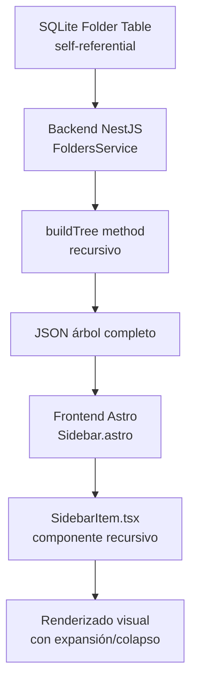
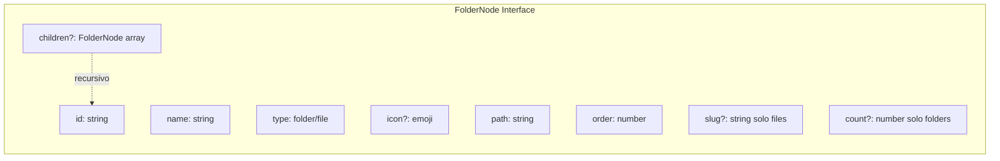
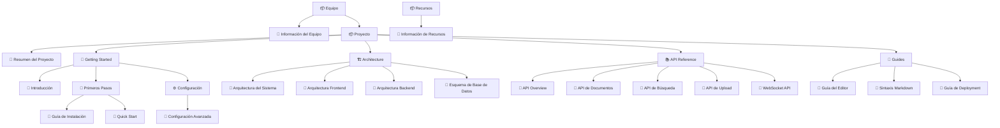
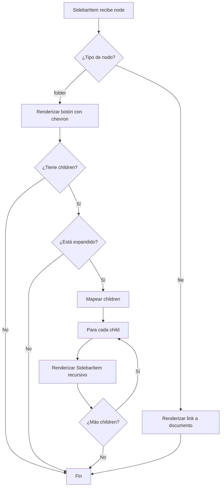
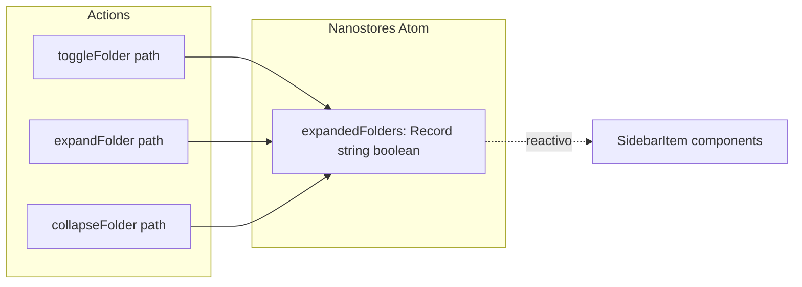
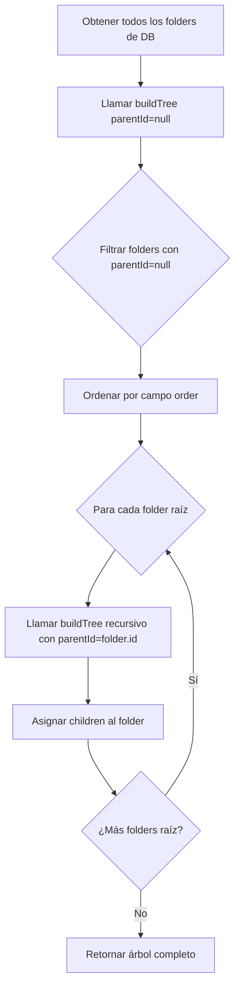
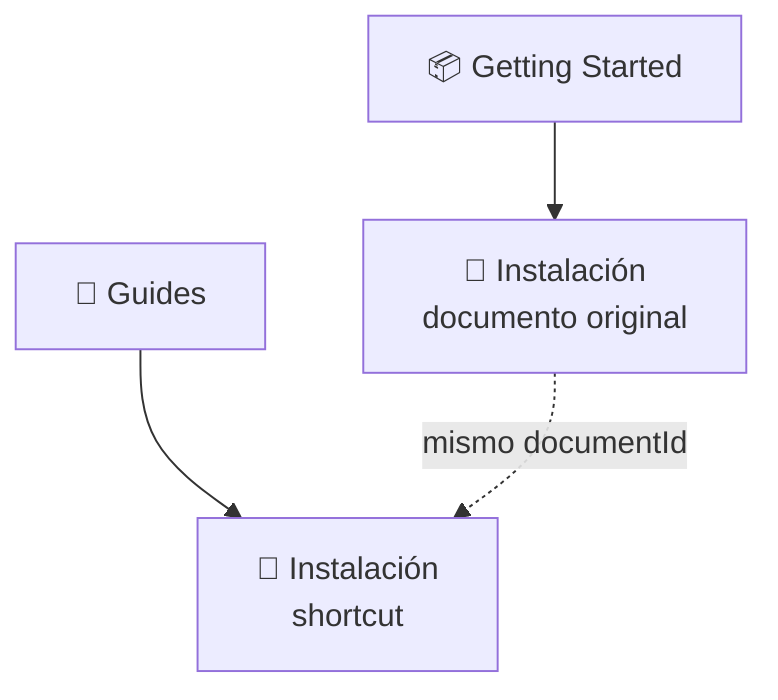

# 🗂️ Sistema de Navegación Jerárquica

**Tipo**: Estructura Obsidian-style  
**Versión**: v0.5  
**Última actualización**: Noviembre 2025

---

## 📋 VISIÓN GENERAL

Ailurus implementa un sistema de navegación jerárquica tipo **Obsidian** con carpetas anidadas ilimitadas.

**Características principales**:
- 🌳 Jerarquía ilimitada: Carpetas dentro de carpetas sin límite
- 🔄 Recursión nativa: Estructura auto-referencial en base de datos
- 📁 Tipos diferenciados: FOLDER (carpeta) vs FILE (link a documento)
- 🎨 Iconos emoji: Cada nodo puede tener un icono visual
- 🔢 Ordenamiento controlado: Propiedad `order` para sorting personalizado
- 🔗 Múltiples ubicaciones: Un documento puede aparecer en varias carpetas (M:M)

---

## 🏗️ ARQUITECTURA DEL SISTEMA

---

## 📐 MODELO DE DATOS

### Interface FolderNode

**Implementación**: `frontend/src/shared/types/folder.types.ts`

### Tabla Database

**Implementación**: `backend/prisma/schema.prisma`

| Campo | Tipo | Descripción |
|-------|------|-------------|
| `id` | Int (PK) | Identificador único |
| `name` | String | Nombre del folder/file |
| `type` | Enum | FOLDER o FILE |
| `icon` | String | Emoji opcional |
| `path` | String (UK) | Ruta completa única |
| `order` | Int | Orden de aparición |
| `parentId` | Int (FK) | Padre (NULL = raíz) |

**Características**:
- `parentId`: Permite jerarquía ilimitada (null = raíz)
- `path`: Ruta única para búsqueda directa ("Equipo/Proyecto/...")
- `onDelete: Cascade`: Al borrar carpeta, borra todos sus hijos

---

## 🌲 JERARQUÍA REAL DEL SISTEMA

### Estructura Actual (29 nodos)

**Total**: 9 folders + 20 files = **29 nodos**

---

## 🎯 IMPLEMENTACIÓN FRONTEND

### Componente: SidebarItem.tsx

**Implementación**: `frontend/src/shared/components/layout/SidebarItem.tsx` (174 líneas)

### Flujo de Renderizado Recursivo

**Características**:
- ✅ Recursión: Llama a sí mismo para cada hijo
- ✅ Estado local: Cada folder mantiene su estado de expansión
- ✅ Indentación visual: `padding-left: ${level * 1rem}`
- ✅ Highlight activo: Compara `currentSlug` con `node.slug`
- ✅ Iconos dinámicos: Alterna entre `Folder` y `FolderOpen`
- ✅ Badges: Muestra count de hijos en folders
- ✅ Keyboard nav: Enter, Space, Arrow keys

---

## 📊 ESTADO GLOBAL

### Store: folder-tree.store.ts

**Implementación**: `frontend/src/shared/stores/folder-tree.store.ts`

**Funcionalidad**: Gestiona qué folders están expandidos usando un objeto con paths como keys y booleanos como values.

---

## 🔧 IMPLEMENTACIÓN BACKEND

### FoldersService

**Implementación**: `backend/src/modules/folders/folders.service.ts` (244 líneas)

### Algoritmo BuildTree

**Complejidad**: O(n) donde n = total de folders

---

## ♿ ACCESIBILIDAD

### Keyboard Navigation

| Tecla | Acción |
|-------|--------|
| `Tab` | Navegar entre folders/files |
| `Enter` / `Space` | Expandir/colapsar folder o abrir file |
| `Arrow Down` | Siguiente item |
| `Arrow Up` | Item anterior |
| `Arrow Right` | Expandir folder (si está cerrado) |
| `Arrow Left` | Colapsar folder (si está abierto) |

### ARIA Labels

- Buttons: `role="treeitem"` con `aria-expanded`
- Links: `role="treeitem"` con `aria-current="page"` para activo
- Labels descriptivos: "Folder {name} with {count} items"

### WCAG 2.2 AA Compliance

- ✅ Contrast ratio: 4.5:1 mínimo
- ✅ Focus visible: Outline de 2px
- ✅ Touch targets: Mínimo 44x44px en móvil
- ✅ Screen readers: Labels descriptivos

---

## 🔄 RELACIÓN M:M CON DOCUMENTOS

### Caso de Uso: Shortcuts

### Tabla Junction: FolderDocument

**Implementación**: `backend/prisma/schema.prisma`

| Campo | Tipo | Descripción |
|-------|------|-------------|
| `folderId` | Int (PK, FK) | ID del folder |
| `documentId` | Int (PK, FK) | ID del documento |
| `order` | Int | Orden en el folder |

**Composite PK**: `(folderId, documentId)`

---

## 📈 PERFORMANCE

### Optimizaciones Implementadas

1. **Índices estratégicos**:
   - `parentId`: Búsqueda de hijos rápida
   - `path`: Lookup directo por ruta
   - `type`: Filtrado folder vs file

2. **Memoización frontend**:
   - React.memo en SidebarItem
   - useMemo para children filtrados
   - Evita re-renders innecesarios

---

## 📚 REFERENCIAS

- **Frontend Component**: `frontend/src/shared/components/layout/SidebarItem.tsx`
- **Frontend Store**: `frontend/src/shared/stores/folder-tree.store.ts`
- **Backend Service**: `backend/src/modules/folders/folders.service.ts`
- **Database Schema**: `backend/prisma/schema.prisma`

**Siguiente**: Ver [Design System](./DESIGN_SYSTEM.md) para componentes UI.
