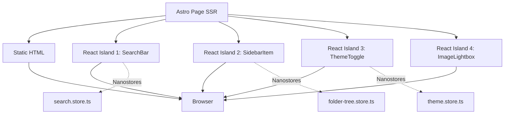
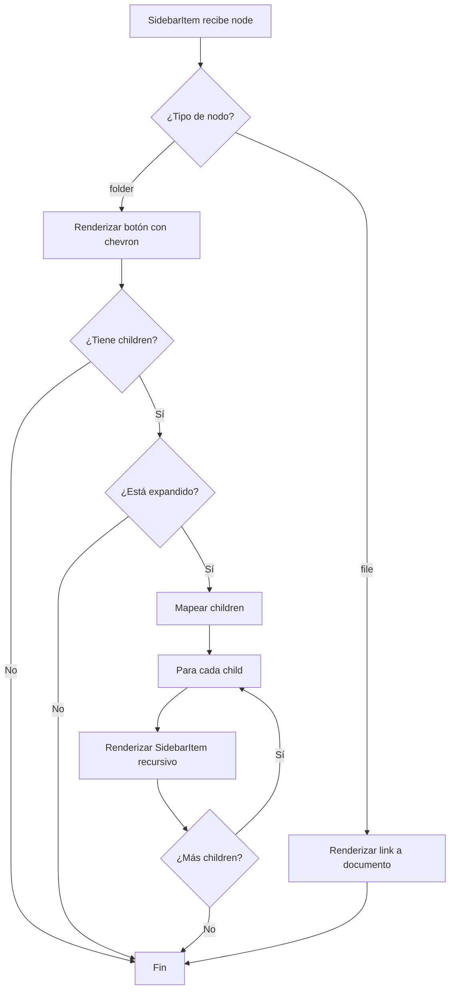
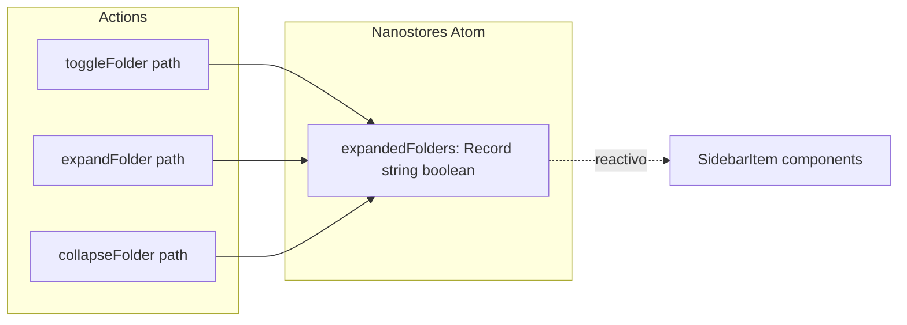
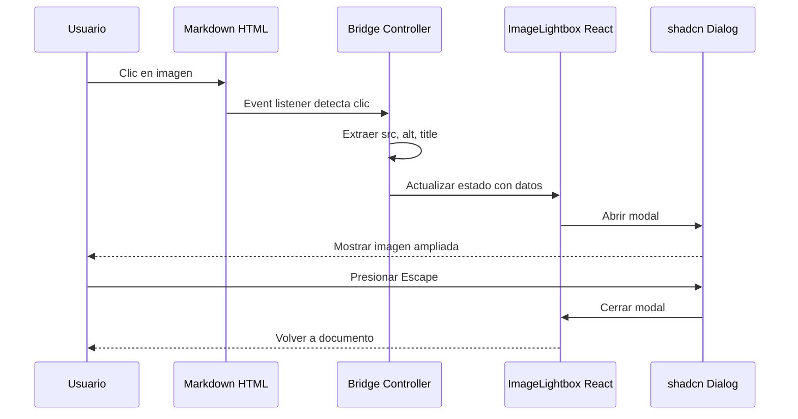
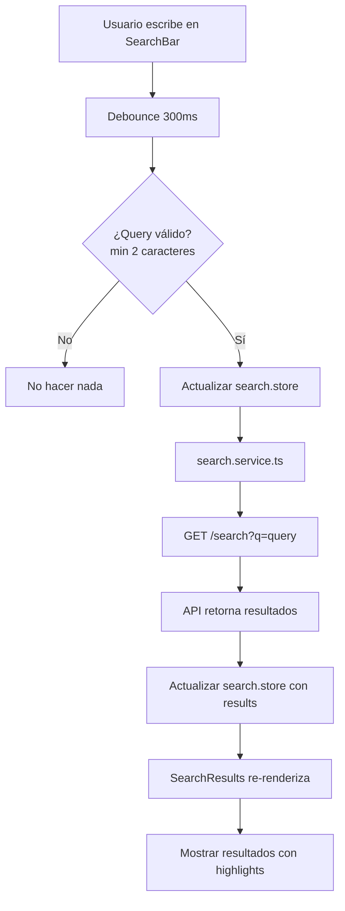
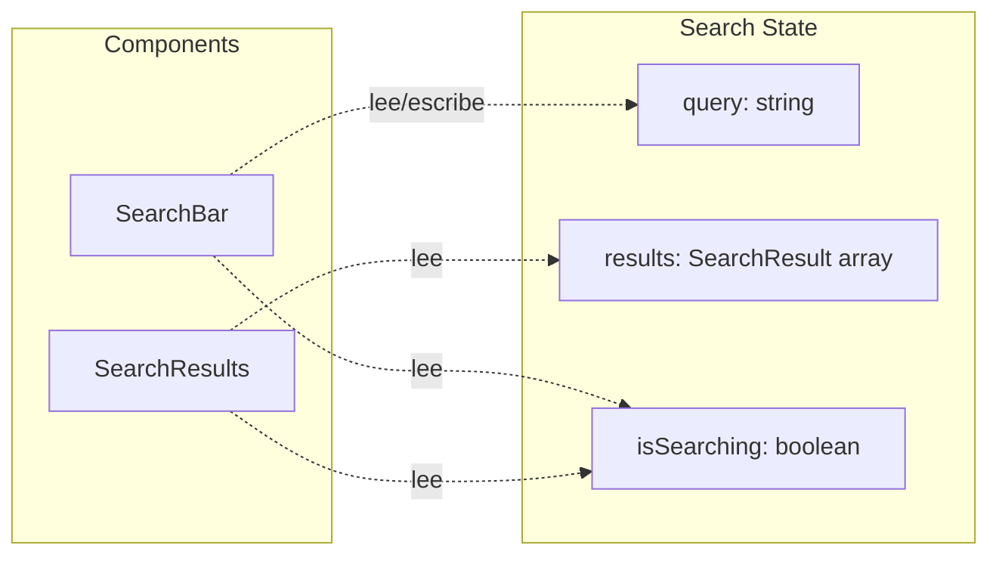
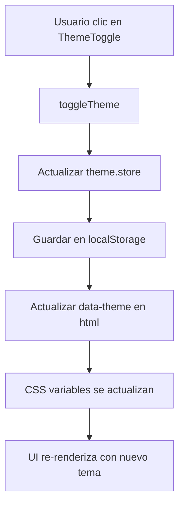
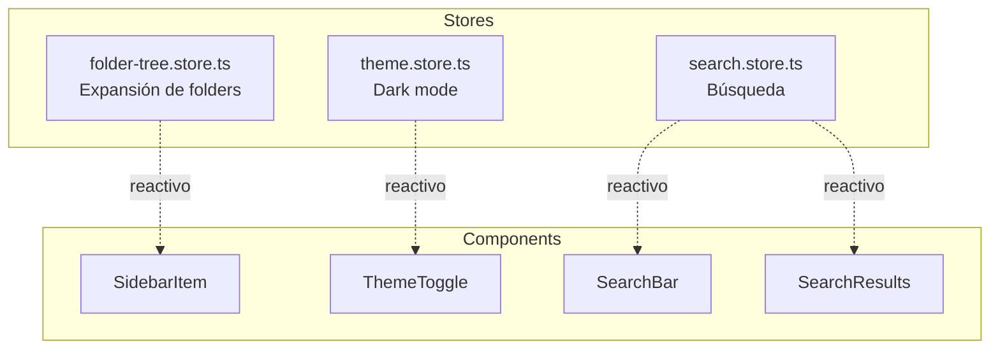
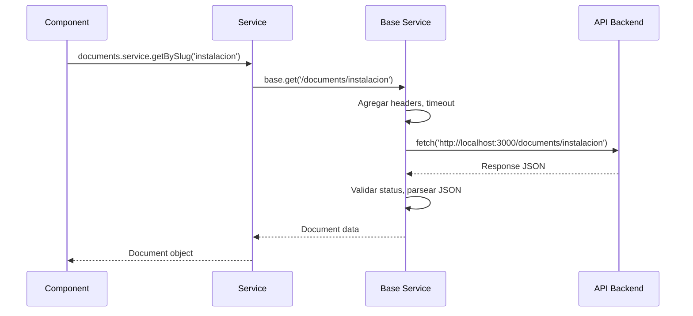
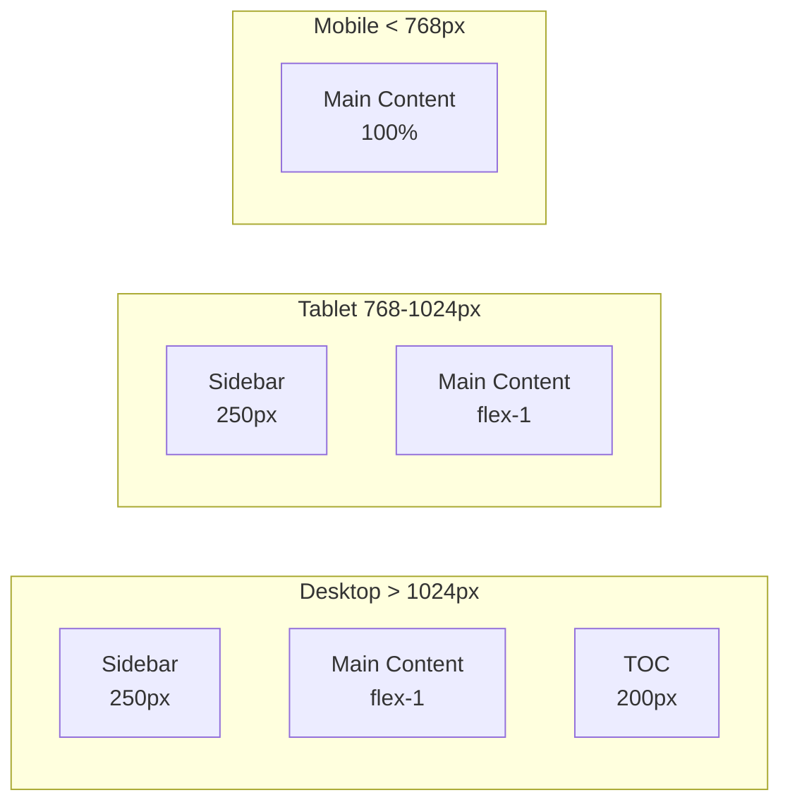

# 🎨 Frontend Architecture - Astro + React

**Framework**: Astro 5.15.9 + React 19.2.0  
**Versión**: v0.5  
**Última actualización**: Noviembre 2025

---

## 📋 VISIÓN GENERAL

Aplicación de documentación renderizada por servidor (SSR) con Astro, optimizada para SEO y performance. Utiliza Islands Architecture para interactividad selectiva con React.

### Stack Tecnológico

- **Framework**: Astro 5.15.9 (SSR)
- **UI Library**: React 19.2.0 (islands)
- **Styling**: Tailwind CSS + shadcn/ui
- **State**: Nanostores 0.11.3
- **Markdown**: marked.js + Shiki
- **TypeScript**: 5.x

### Características Principales

- 🚀 SSR para carga inicial rápida y SEO
- 🏝️ Islands Architecture para interactividad selectiva
- 🗂️ Navegación jerárquica recursiva (Obsidian-style)
- 📝 Editor Markdown con auto-save
- 🔍 Búsqueda en tiempo real
- 🖼️ Sistema de imágenes con lightbox
- 🎨 Dark mode con persistencia
- ♿ Accesibilidad WCAG 2.2 AA
- 📱 Responsive design mobile-first

---

## 🗂️ ESTRUCTURA DE CARPETAS

**Implementación**: `frontend/src/`

```
src/
├── components/ui/     # 15 shadcn/ui components
├── documents/         # DocumentList, NewDocumentForm
├── editor/            # MarkdownEditor
├── layouts/           # Layout, DocsLayout, EditorLayout
├── markdown/          # MarkdownRenderer, ImageLightbox
├── mocks/             # documents.mock.ts, folders.mock.ts
├── pages/             # 18 páginas Astro
├── search/            # SearchBar, SearchResults
├── services/          # API services
├── shared/            # components, stores, types, utils
├── styles/            # CSS global
└── lib/               # Utilities
```

**Totales**:
- 22 componentes React (.tsx)
- 18 páginas Astro (.astro)
- 12 carpetas principales
- 15 componentes shadcn/ui instalados

---

## 🏗️ ISLANDS ARCHITECTURE



**Concepto**: Astro renderiza HTML estático en el servidor. Solo los componentes que requieren interactividad (islands) se hidratan como React en el cliente, reduciendo el JavaScript enviado al navegador.

---

## 📦 COMPONENTES PRINCIPALES

### Tabla de Componentes shadcn/ui (15 instalados)

| Componente | Ubicación | Uso Principal |
|------------|-----------|---------------|
| Badge | `components/ui/badge.tsx` | Etiquetas de categorías |
| Button | `components/ui/button.tsx` | Acciones principales |
| Card | `components/ui/card.tsx` | Cards de documentos |
| Dialog | `components/ui/dialog.tsx` | Modales (lightbox, forms) |
| Dropdown Menu | `components/ui/dropdown-menu.tsx` | Menús contextuales |
| Input | `components/ui/input.tsx` | Campos de formulario |
| Label | `components/ui/label.tsx` | Labels accesibles |
| Select | `components/ui/select.tsx` | Selectores |
| Separator | `components/ui/separator.tsx` | Separadores visuales |
| Skeleton | `components/ui/skeleton.tsx` | Loading states |
| Tabs | `components/ui/tabs.tsx` | Pestañas |
| Textarea | `components/ui/textarea.tsx` | Editor de texto |
| Toast | `components/ui/toast.tsx` | Notificaciones |
| Toaster | `components/ui/toaster.tsx` | Contenedor de toasts |
| Tooltip | `components/ui/tooltip.tsx` | Tooltips informativos |

### Tabla de Componentes Custom

| Componente | Archivo | Líneas | Descripción |
|------------|---------|--------|-------------|
| SidebarItem | `shared/components/layout/SidebarItem.tsx` | 174 | Navegación recursiva |
| ImageLightbox | `markdown/components/ImageLightbox.tsx` | ~100 | Modal de imágenes |
| MarkdownEditor | `editor/components/MarkdownEditor.tsx` | ~150 | Editor con preview |
| SearchBar | `search/components/SearchBar.tsx` | ~80 | Búsqueda en tiempo real |
| SearchResults | `search/components/SearchResults.tsx` | ~120 | Lista de resultados |
| ThemeToggle | `shared/components/layout/ThemeToggle.tsx` | ~60 | Toggle dark mode |

---

## 🗂️ NAVEGACIÓN JERÁRQUICA

### Componente: SidebarItem.tsx

**Implementación**: `frontend/src/shared/components/layout/SidebarItem.tsx` (174 líneas)

**Características**:
- Renderizado recursivo de niveles ilimitados
- Gestión de estado de expansión con Nanostores
- Soporte completo de teclado (Enter, Space, flechas)
- Etiquetas ARIA para accesibilidad
- Iconos emoji para categorías
- Indicador de conteo de children

### Flujo de Renderizado Recursivo



### Store: folder-tree.store.ts

**Implementación**: `frontend/src/shared/stores/folder-tree.store.ts`



**Funcionalidad**: Gestiona qué folders están expandidos usando un objeto con paths como keys y booleanos como values. Persiste en memoria durante la sesión.

---

## 🖼️ SISTEMA DE IMÁGENES

### Componente: ImageLightbox

**Implementación**: `frontend/src/markdown/components/ImageLightbox.tsx`

**Características**:
- Modal con shadcn Dialog
- Lazy loading de imágenes
- Captions opcionales (desde atributo `title`)
- Keyboard navigation (Escape para cerrar)
- Focus trap automático
- Bridge vanilla→React para integración con markdown

### Flujo de Interacción



---

## 🔍 BÚSQUEDA

### Componentes

**SearchBar.tsx**: Input con debounce de 300ms
**SearchResults.tsx**: Lista de resultados con highlights

### Flujo de Búsqueda



### Store: search.store.ts

**Implementación**: `frontend/src/shared/stores/search.store.ts`



---

## 🎨 SISTEMA DE TEMAS

### Store: theme.store.ts

**Implementación**: `frontend/src/shared/stores/theme.store.ts`

**Funcionalidad**:
- Gestiona tema actual (light/dark)
- Persiste en localStorage
- Actualiza atributo `data-theme` en `<html>`
- Detecta preferencia del sistema

### Flujo de Cambio de Tema



---

## 📄 ROUTING

### Tabla de Rutas

| Ruta | Archivo | Descripción |
|------|---------|-------------|
| `/` | `pages/index.astro` | Landing page |
| `/docs` | `pages/docs/index.astro` | Lista de documentos |
| `/docs/[...slug]` | `pages/docs/[...slug].astro` | Vista de documento |
| `/docs/new` | `pages/docs/new.astro` | Crear documento |
| `/docs/edit/[...slug]` | `pages/docs/edit/[...slug].astro` | Editar documento |
| `/search` | `pages/search.astro` | Búsqueda |
| `/architecture` | `pages/architecture/index.astro` | Arquitectura |
| `/architecture/frontend` | `pages/architecture/frontend.astro` | Frontend |
| `/architecture/backend` | `pages/architecture/backend.astro` | Backend |
| `/architecture/database` | `pages/architecture/database.astro` | Database |

**Total**: 18 páginas Astro

---

## 🔄 GESTIÓN DE ESTADO

### Nanostores

**Implementación**: `frontend/src/shared/stores/`



**Ventajas de Nanostores**:
- Tamaño mínimo (~300 bytes)
- Framework-agnostic (funciona con Astro + React)
- Reactivo sin re-renders innecesarios
- TypeScript nativo

---

## 📡 SERVICIOS API

### Implementación

**Base Service**: `frontend/src/services/api/base.service.ts`
- Cliente HTTP con fetch
- Manejo de errores
- Timeout de 10 segundos

**Servicios Específicos**:
- `documents.service.ts`: CRUD de documentos
- `folders.service.ts`: Árbol jerárquico
- `categories.service.ts`: Categorías fijas
- `search.service.ts`: Búsqueda FTS5

### Flujo de Request



---

## 🎨 DISEÑO RESPONSIVE

### Breakpoints

| Breakpoint | Ancho | Layout |
|------------|-------|--------|
| Mobile | < 768px | Single column, sidebar hidden |
| Tablet | 768px - 1024px | Two columns, TOC hidden |
| Desktop | > 1024px | Three columns (sidebar, main, TOC) |

### Grid Layout



---

## ⚡ OPTIMIZACIONES

### 1. Code Splitting

- Lazy loading de componentes pesados (Editor, Mermaid)
- Islands solo cargan JavaScript necesario

### 2. Image Optimization

- Lazy loading nativo (`loading="lazy"`)
- Formato WebP cuando disponible
- Dimensiones especificadas para evitar layout shift

### 3. Prefetch

- Prefetch de documentos populares
- Preload de fuentes críticas

---

## 🧪 TESTING

**Framework**: Vitest (configurado pero no implementado en POC)

**Estrategia futura**:
- Unit tests para utilities y services
- Component tests para componentes React
- E2E tests con Playwright

---

## 🚀 DEPLOYMENT

### Build para Producción

```bash
npm run build
```

Genera `dist/` con:
- Servidor SSR (Node.js)
- Assets estáticos optimizados
- HTML pre-renderizado

### Variables de Entorno

```env
PUBLIC_API_URL=http://localhost:3000
PUBLIC_WS_URL=ws://localhost:3000
```

---

## 📚 REFERENCIAS

- **Componentes**: `frontend/src/`
- **Stores**: `frontend/src/shared/stores/`
- **Services**: `frontend/src/services/`
- **Mocks**: `frontend/src/mocks/`
- **Configuración**: `frontend/astro.config.mjs`, `frontend/tailwind.config.mjs`

**Siguiente**: Ver [Design System](./DESIGN_SYSTEM.md) para detalles de componentes shadcn/ui.
