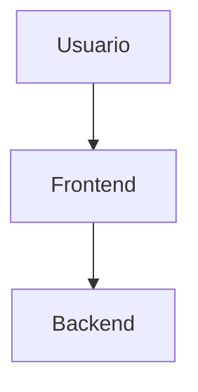

# 🗺️ Frontend Sitemap - Ailurus

**Proyecto**: Ailurus  
**Fecha**: 18 de noviembre, 2025  
**Versión**: POC v0.1

---

## 📋 **ESTRUCTURA DE NAVEGACIÓN**

```
/                                   # Homepage
├── /docs                           # Documentación principal
│   ├── /docs/:slug                # Vista de documento individual
│   ├── /docs/:slug/edit           # Editor de documento
│   └── /docs/search               # Búsqueda de documentación
│
├── /search                         # Búsqueda global
│   └── /search?q=query            # Resultados de búsqueda
│
└── (Futuras v0.5+)
    ├── /dashboard                 # Dashboard de analytics
    ├── /settings                  # Configuración de usuario
    └── /admin                     # Panel de administración
```

---

## 🎯 **RUTAS Y PÁGINAS**

### **1. Homepage** `/`

**Archivo**: `src/pages/index.astro`

**Propósito**: Landing page principal del sistema de documentación

**Contenido**:

- Hero section con descripción del proyecto
- Features principales (edición en tiempo real, búsqueda, colaboración)
- CTA para acceder a la documentación
- Links rápidos a documentos destacados
- Dark mode toggle

**Componentes**:

- `Welcome.astro` (componente principal)
- `Header.astro` (navegación global)
- `Footer.astro` (links y copyright)

**Interacciones**:

- Click en "Ver Documentación" → `/docs`
- Click en "Buscar" → `/search`
- Toggle dark mode → Persistir en localStorage

**Estado**: ✅ POC v0.1

---

### **2. Lista de Documentos** `/docs`

**Archivo**: `src/documents/pages/index.astro`

**Propósito**: Índice navegable de toda la documentación

**Contenido**:

- Sidebar con categorías de documentos
- Lista de documentos con:
  - Título
  - Excerpt (primeras líneas)
  - Fecha de última actualización
  - Tags/categorías (v0.5+)
- Barra de búsqueda rápida
- Botón "Nuevo Documento" (si autenticado - v0.5+)

**Componentes**:

- `DocumentList.astro`
- `Sidebar.astro`
- `SearchBar.tsx` (React interactivo)

**API Calls**:

```typescript
GET / docs;
// Response: Document[]
```

**Interacciones**:

- Click en documento → `/docs/:slug`
- Click en categoría → Filtrar lista
- Búsqueda → Filtrado en tiempo real
- Scroll infinito (v0.5+)

**Estado**: ✅ POC v0.1

---

### **3. Vista de Documento** `/docs/:slug`

**Archivo**: `src/documents/pages/[...slug].astro`

**Propósito**: Lectura de documento individual con navegación

**Contenido**:

- **Sidebar izquierdo**:
  - Navegación de documentos
  - Categorías colapsables
  - Indicador de documento actual
- **Contenido principal**:
  - Header con título y metadata
  - Contenido Markdown renderizado
  - Code blocks con syntax highlighting
  - Diagramas Mermaid.js
  - Imágenes optimizadas (WebP)
  - Tabs para contenido multi-plataforma
  - Botón "Editar" (si autenticado - v0.5+)
- **TOC derecho** (Table of Contents):
  - Lista de headers del documento
  - Scroll sticky
  - Auto-highlight al scroll

**Componentes**:

- `DocumentViewer.astro`
- `MarkdownRenderer.astro`
- `CodeBlock.astro` con botón Copy
- `MermaidDiagram.tsx`
- `Sidebar.astro`
- `TOC.astro`
- `DocumentMeta.astro` (fecha, autor)

**API Calls**:

```typescript
GET /docs/:slug
// Response: Document
```

**Interacciones**:

- Click en TOC → Scroll suave a sección
- Click en link interno → Navegar a otro documento
- Click en "Editar" → `/docs/:slug/edit`
- Click en "Copy" en code block → Copiar al portapapeles
- Hover en heading → Mostrar link de anchor
- Click en anchor → Copiar URL al portapapeles

**Optimizaciones**:

- SSR completo (SEO friendly)
- Lazy loading de imágenes
- Prefetch de links internos
- Cache de documentos frecuentes

**Estado**: ✅ POC v0.1

---

### **4. Editor de Documento** `/docs/:slug/edit`

**Archivo**: `src/editor/pages/edit.astro`

**Propósito**: Edición inline de documentos con preview en tiempo real

**Contenido**:

- **Header del editor**:
  - Título editable
  - Indicador de presencia (usuarios editando)
  - Estado de guardado: "Guardando...", "Guardado", "Error"
  - Botones: "Guardar Draft", "Publicar", "Cancelar"
- **Editor principal**:
  - SimpleMDE (Markdown editor)
  - Toolbar con acciones: bold, italic, heading, code, link, image
  - Preview en tiempo real (lado a lado o full)
  - Auto-save cada 5 segundos
  - Upload de imágenes drag & drop
- **Sidebar derecho**:
  - Preview del documento
  - Metadata editable (tags, categoría - v0.5+)
  - Historial de versiones (v0.5+)

**Componentes**:

- `SimpleMDEditor.tsx` (React)
- `EditorToolbar.tsx`
- `EditorPreview.tsx`
- `ImageUploader.tsx`
- `PresenceIndicator.tsx` (WebSocket)

**API Calls**:

```typescript
// Cargar documento
GET /docs/:slug

// Auto-save draft
PUT /docs/:id/draft
Body: { title, content }
// Trigger: Cada 5s si hay cambios

// Publicar
PUT /docs/:id/publish

// Upload imagen
POST /upload/image
FormData: { image: File }
```

**WebSocket Events**:

```typescript
// Conectar al documento
socket.emit("editing-start", { documentId, userId, username });

// Notificar a otros usuarios
socket.on("user-editing", (user) => {
  // Mostrar indicador de presencia
});

// Usuario dejó de editar
socket.on("user-stopped-editing", ({ userId }) => {
  // Remover indicador
});
```

**Interacciones**:

- **Escribir** → Auto-save después de 5s
- **Drag & Drop imagen** → Upload automático → Insertar Markdown
- **Ctrl+V imagen** → Upload automático → Insertar Markdown
- **Click "Publicar"** → Confirmar → Publicar → Redirigir a `/docs/:slug`
- **Click "Cancelar"** → Confirmar si hay cambios → Redirigir
- **Cerrar pestaña** → Warning si hay cambios sin guardar
- **Toolbar actions** → Insertar Markdown syntax

**Estado del Store** (`editor.store.ts`):

```typescript
{
  isEditing: true,
  isSaving: false,
  lastSaved: Date,
  hasUnsavedChanges: true,
  otherUsers: [
    { userId: 'user-1', username: 'Antonio' },
    { userId: 'user-2', username: 'María' }
  ]
}
```

**Warnings**:

- ⚠️ Si otro usuario está editando → "Otro usuario está editando. Last save wins."
- ⚠️ Si hay cambios sin guardar → "Tienes cambios sin guardar. ¿Salir?"

**Estado**: ✅ POC v0.1

---

### **5. Búsqueda Global** `/search?q=query`

**Archivo**: `src/search/pages/search.astro`

**Propósito**: Búsqueda full-text en documentación con resultados relevantes

**Contenido**:

- **Header de búsqueda**:
  - Input con query prellenado
  - Indicador de resultados: "X resultados para 'query'"
  - Tiempo de búsqueda
- **Filtros** (v0.5+):
  - Por categoría
  - Por fecha
  - Por autor
- **Lista de resultados**:
  - Título del documento (clickable)
  - Excerpt con término resaltado
  - Fecha de actualización
  - Relevancia (rank)
  - Breadcrumb de navegación
- **Sin resultados**:
  - Mensaje: "No se encontraron resultados para 'query'"
  - Sugerencias: "¿Quisiste decir...?" (v0.5+)
  - Links a documentos populares

**Componentes**:

- `SearchBar.tsx` (React con debounce)
- `SearchResults.tsx`
- `SearchResultItem.tsx`
- `SearchFilters.tsx` (v0.5+)
- `SearchHighlight.tsx` (resalta término)

**API Calls**:

```typescript
GET /search?q=arquitectura&limit=20
// Response: SearchResult[]

POST /analytics/track
Body: {
  eventType: 'search_query',
  metadata: { query, resultsCount }
}
```

**Interacciones**:

- **Escribir en search bar** → Debounce 300ms → Nueva búsqueda
- **Click en resultado** → Navegar a `/docs/:slug`
- **Click en filtro** → Re-ejecutar búsqueda con filtros
- **Scroll al final** → Cargar más resultados (v0.5+)

**Estado del Store** (`search.store.ts`):

```typescript
{
  query: 'arquitectura',
  results: SearchResult[],
  isSearching: false,
  hasSearched: true,
  filters: { category: null, dateRange: null } // v0.5+
}
```

**Optimizaciones**:

- Debounce en búsqueda (300ms)
- Cache de resultados recientes
- Highlight de términos con regex
- Analytics de búsquedas sin resultados

**Estado**: ✅ POC v0.1

---

## 🧩 **COMPONENTES COMPARTIDOS**

### **Layout Components**

#### **1. Header.astro** (`shared/components/layout/Header.astro`)

**Contenido**:

- Logo + Nombre del proyecto
- Navegación principal: Home, Docs, Search
- Barra de búsqueda rápida
- Dark mode toggle
- Avatar de usuario (v0.5+)

**Interacciones**:

- Click logo → `/`
- Click "Docs" → `/docs`
- Click "Search" → Focus en search bar
- Toggle dark mode → Actualizar theme store

---

#### **2. Sidebar.astro** (`shared/components/layout/Sidebar.astro`)

**Contenido**:

- Logo/Brand
- Lista de categorías colapsables
- Lista de documentos por categoría
- Indicador de documento activo
- Botón "Nuevo Documento" (v0.5+)

**Props**:

```typescript
interface Props {
  currentSlug?: string;
  categories?: Category[];
}
```

**Interacciones**:

- Click en categoría → Expand/Collapse
- Click en documento → Navegar a documento
- Scroll sticky (siempre visible)
- Responsive: Colapsable en móvil

**Estado**: Estático en POC v0.1, dinámico en v0.5+

---

#### **3. TOC.astro** (Table of Contents)

(`shared/components/layout/TOC.astro`)

**Contenido**:

- Lista de headers extraídos del contenido
- Indentación por nivel (h2, h3, h4)
- Indicador visual de sección actual
- "Back to top" al final

**Props**:

```typescript
interface Props {
  content: string; // Markdown content
}
```

**Interacciones**:

- Click en item → Scroll suave a sección
- Scroll en página → Auto-highlight TOC item
- Scroll sticky (siempre visible)

**Lógica de extracción**:

```typescript
const headings = extractHeadings(content);
// headings: [{ id, text, level }]
```

---

#### **4. Footer.astro**

**Contenido**:

- Links útiles
- Copyright
- Versión del sistema
- Links a GitHub/docs oficiales

---

### **UI Components**

#### **1. Button.astro** (`shared/components/ui/Button.astro`)

**Variantes**:

- `primary`: Accent color
- `secondary`: Gray
- `ghost`: Transparent
- `danger`: Red

**Tamaños**:

- `sm`, `md`, `lg`

**Props**:

```typescript
interface Props {
  variant?: "primary" | "secondary" | "ghost" | "danger";
  size?: "sm" | "md" | "lg";
  href?: string;
  type?: "button" | "submit" | "reset";
  disabled?: boolean;
}
```

---

#### **2. Modal.tsx** (`shared/components/ui/Modal.tsx`)

**Uso**: Confirmaciones, previews, formularios

**Props**:

```typescript
interface Props {
  isOpen: boolean;
  onClose: () => void;
  title: string;
  children: React.ReactNode;
}
```

**Interacciones**:

- Click overlay → Cerrar
- ESC key → Cerrar
- Click "X" → Cerrar

---

#### **3. Toast.tsx** (`shared/components/ui/Toast.tsx`)

**Uso**: Notificaciones temporales

**Tipos**:

- `success`: Verde
- `error`: Rojo
- `info`: Azul
- `warning`: Amarillo

**Props**:

```typescript
interface Props {
  type: "success" | "error" | "info" | "warning";
  message: string;
  duration?: number; // Default: 3000ms
}
```

---

#### **4. Tabs.tsx** (`shared/components/ui/Tabs.tsx`)

**Uso**: Contenido multi-plataforma (Windows, Linux, macOS)

**Props**:

```typescript
interface Props {
  tabs: Array<{
    label: string;
    content: React.ReactNode;
  }>;
  defaultTab?: number;
}
```

**Interacciones**:

- Click en tab → Cambiar contenido
- Keyboard: Arrow keys → Navegar tabs

---

### **Feature Components**

#### **1. SearchBar.tsx** (`search/components/SearchBar.tsx`)

**Uso**: Input de búsqueda con debounce y auto-complete (v0.5+)

**Props**:

```typescript
interface Props {
  placeholder?: string;
  onSearch: (query: string) => void;
  debounceMs?: number; // Default: 300
}
```

**Estado interno**:

```typescript
const [input, setInput] = useState("");
const [suggestions, setSuggestions] = useState([]); // v0.5+
```

---

#### **2. PresenceIndicator.tsx** (`editor/components/PresenceIndicator.tsx`)

**Uso**: Mostrar usuarios editando en tiempo real

**Props**:

```typescript
interface Props {
  users: Array<{
    userId: string;
    username: string;
  }>;
}
```

**Renderizado**:

- 0 usuarios → No mostrar nada
- 1 usuario → "Antonio está editando"
- 2+ usuarios → "3 usuarios editando" + Tooltip con nombres

---

#### **3. ImageUploader.tsx** (`editor/components/ImageUploader.tsx`)

**Uso**: Drag & drop y Ctrl+V para subir imágenes

**Props**:

```typescript
interface Props {
  onUpload: (url: string) => void;
  maxSize?: number; // Default: 5MB
  acceptedFormats?: string[]; // Default: jpeg, png, gif, webp
}
```

**Interacciones**:

- Drag & Drop → Preview → Upload → Callback con URL
- Ctrl+V → Upload → Callback con URL
- Click "Upload" → File picker → Upload

---

#### **4. CodeBlock.astro** (`markdown/components/CodeBlock.astro`)

**Uso**: Code blocks con syntax highlighting y botón Copy

**Props**:

```typescript
interface Props {
  code: string;
  language: string;
  filename?: string;
  showLineNumbers?: boolean;
}
```

**Interacciones**:

- Click "Copy" → Copiar código → Feedback "Copied!"
- Hover → Mostrar botón Copy

---

#### **5. MermaidDiagram.tsx** (`markdown/components/MermaidDiagram.tsx`)

**Uso**: Renderizar diagramas Mermaid.js desde Markdown

**Props**:

```typescript
interface Props {
  code: string;
}
```

**Ejemplo de uso en Markdown**:

````markdown

````

---

## 🔄 **FLUJOS DE USUARIO**

### **Flujo 1: Lectura de Documentación**

```
Usuario → / (Homepage)
  ↓ Click "Ver Documentación"
Usuario → /docs (Lista)
  ↓ Click en "Arquitectura"
Usuario → /docs/arquitectura (Vista)
  ↓ Scroll + Click en TOC
Usuario → Navega por secciones
  ↓ Click en link interno
Usuario → /docs/backend-architecture
```

**Páginas involucradas**: 3  
**API Calls**: 2 (GET /docs, GET /docs/:slug)  
**WebSocket**: No

---

### **Flujo 2: Búsqueda de Contenido**

```
Usuario → /docs/arquitectura
  ↓ Click en Search bar (Header)
Usuario → Focus en search input
  ↓ Escribe "nestjs"
Sistema → Debounce 300ms → GET /search?q=nestjs
  ↓ Mostrar sugerencias dropdown (v0.5+)
Usuario → Enter o Click en "Ver todos"
  ↓ Navegar
Usuario → /search?q=nestjs
  ↓ Lista de resultados
Usuario → Click en resultado
  ↓ Navegar
Usuario → /docs/guia-nestjs
```

**Páginas involucradas**: 2  
**API Calls**: 1-2 (GET /search)  
**WebSocket**: No

---

### **Flujo 3: Edición de Documento**

```
Usuario → /docs/arquitectura
  ↓ Click "Editar" (v0.5+ con auth)
Usuario → /docs/arquitectura/edit
  ↓ WebSocket connect
Sistema → socket.emit('editing-start')
  ↓ Broadcast a otros usuarios
Otros usuarios → Ver indicador presencia
  ↓ Usuario escribe contenido
Sistema → Auto-save cada 5s (PUT /docs/1/draft)
  ↓ Mostrar "Guardado" + timestamp
Usuario → Drag & Drop imagen
Sistema → POST /upload/image
  ↓ Recibir URL
Sistema → Insertar Markdown 
  ↓ Usuario satisfecho
Usuario → Click "Publicar"
Sistema → PUT /docs/1/publish
  ↓ Redirigir
Usuario → /docs/arquitectura (documento publicado)
Sistema → WebSocket disconnect
```

**Páginas involucradas**: 2  
**API Calls**: 10+ (1 GET, múltiples PUT draft, 1 POST upload, 1 PUT publish)  
**WebSocket**: Sí (presencia)

---

### **Flujo 4: Crear Nuevo Documento** (v0.5+)

```
Usuario → /docs
  ↓ Click "Nuevo Documento"
Sistema → Modal "Título del documento"
Usuario → Escribe título
  ↓ Click "Crear"
Sistema → POST /docs { title }
  ↓ Recibir ID y slug
Sistema → Redirigir
Usuario → /docs/:slug/edit
  ↓ Continúa como Flujo 3
```

**Páginas involucradas**: 2  
**API Calls**: 1 (POST /docs)  
**WebSocket**: No (hasta que entra al editor)

---

## 📊 **ANALYTICS Y TRACKING**

### **Eventos Rastreados en POC v0.1**

| Evento          | Trigger                         | API Call                  | Metadata                      |
| --------------- | ------------------------------- | ------------------------- | ----------------------------- |
| `page_view`     | Usuario carga cualquier página  | POST /analytics/track     | page, referrer, userAgent     |
| `search_query`  | Usuario realiza búsqueda        | POST /analytics/track     | query, resultsCount           |
| `document_edit` | Usuario abre editor             | POST /analytics/track     | documentId, userId            |
| `image_upload`  | Usuario sube imagen             | Implícito en POST /upload | documentId, imageSize, format |
| `copy_code`     | Usuario copia código de snippet | localStorage (v0.5+)      | language, documentSlug        |

### **Dashboard de Analytics** (v0.5+)

**Ruta**: `/dashboard`

**Contenido**:

- Documentos más visitados
- Términos de búsqueda frecuentes
- Búsquedas sin resultados (para mejorar)
- Usuarios activos en tiempo real
- Gráficos de tendencias

---

## 🎨 **SISTEMA DE DISEÑO**

### **Colores (CSS Variables)**

```css
/* Light theme */
--color-bg-primary: #ffffff;
--color-bg-secondary: #f5f5f5;
--color-text-primary: #1a1a1a;
--color-text-secondary: #666666;
--color-accent: #0070f3;
--color-border: #e5e5e5;

/* Dark theme */
--color-bg-primary: #0a0a0a;
--color-bg-secondary: #1a1a1a;
--color-text-primary: #e5e5e5;
--color-text-secondary: #a0a0a0;
--color-accent: #0070f3;
--color-border: #333333;
```

### **Tipografía**

- **Headers**: Inter, sans-serif (600-700)
- **Body**: Inter, sans-serif (400-500)
- **Code**: Fira Code, monospace

### **Spacing**

- Base: 0.25rem (4px)
- Escala: 0.5rem, 1rem, 1.5rem, 2rem, 3rem, 4rem

### **Breakpoints**

```css
/* Mobile first */
--mobile: 0px;
--tablet: 768px;
--desktop: 1024px;
--wide: 1440px;
```

---

## 📱 **RESPONSIVE DESIGN**

### **Mobile** (<768px)

- Sidebar colapsable con hamburger menu
- TOC oculto (accesible vía botón flotante)
- Editor full-width
- Stack layout (no grid)

### **Tablet** (768px - 1024px)

- Sidebar colapsable opcional
- TOC oculto o overlay
- Editor con preview side-by-side

### **Desktop** (>1024px)

- Layout de 3 columnas: Sidebar + Main + TOC
- Todas las features visibles
- Editor con preview lado a lado

---

## 🔐 **AUTENTICACIÓN Y PERMISOS** (v0.5+)

### **Rutas Públicas** (POC v0.1 - todas públicas)

- `/`
- `/docs`
- `/docs/:slug`
- `/search`

### **Rutas Protegidas** (v0.5+)

- `/docs/:slug/edit` → Requiere role: `editor` o `admin`
- `/dashboard` → Requiere role: `admin`
- `/admin` → Requiere role: `admin`

### **Roles**

| Role     | Permisos                                         |
| -------- | ------------------------------------------------ |
| `viewer` | Solo lectura                                     |
| `editor` | Lectura + Edición de documentos                  |
| `admin`  | Lectura + Edición + Publish + Dashboard + Config |

---

## 🚀 **OPTIMIZACIONES DE PERFORMANCE**

### **SSR (Server-Side Rendering)**

- Todas las páginas renderizadas en servidor
- HTML completo en primera carga
- SEO optimizado

### **Lazy Loading**

- Imágenes con `loading="lazy"`
- Components interactivos con Islands Architecture
- Editor solo carga cuando se necesita

### **Prefetching**

```astro
<link rel="prefetch" href="/docs/arquitectura" />
```

### **Caching**

- Static assets con cache headers largos
- API responses con cache corto (5 min)
- Service Worker para offline (v1.0+)

### **Bundle Optimization**

- Code splitting automático (Astro)
- Tree shaking
- Minificación
- Compression (Brotli/Gzip)

---

## 🧪 **TESTING**

### **Unit Tests**

```typescript
// tests/components/Button.test.ts
test("Button renders correctly", async () => {
  const result = await renderToString(Button, {
    props: { variant: "primary" },
  });
  expect(result).toContain("button--primary");
});
```

### **Integration Tests** (v0.5+)

```typescript
// tests/search.test.ts
test("Search flow works", async () => {
  // 1. Cargar /search
  // 2. Escribir query
  // 3. Verificar resultados
});
```

### **E2E Tests** (v1.0+)

```typescript
// tests/e2e/editing.spec.ts
test("User can edit and publish document", async ({ page }) => {
  await page.goto("/docs/test/edit");
  await page.fill("#editor", "New content");
  await page.click('button:has-text("Publish")');
  await expect(page).toHaveURL("/docs/test");
});
```

---

## 📈 **ROADMAP DE FEATURES**

### **POC v0.1** (Actual)

- ✅ Homepage
- ✅ Lista de documentos
- ✅ Vista de documento
- ✅ Editor inline con SimpleMDE
- ✅ Búsqueda full-text
- ✅ WebSocket presencia
- ✅ Dark mode
- ✅ Responsive

### **v0.5** (+2-3 semanas)

- 🔲 Autenticación JWT
- 🔲 Roles y permisos
- 🔲 Sistema de Review
- 🔲 Dashboard de analytics
- 🔲 Historial de versiones
- 🔲 Sugerencias de búsqueda
- 🔲 Scroll infinito en listas

### **v1.0** (+3-4 semanas)

- 🔲 Editor avanzado (TipTap)
- 🔲 Real-time text collaboration (CRDT)
- 🔲 Comentarios inline
- 🔲 Notificaciones push
- 🔲 Service Worker offline
- 🔲 PWA support

### **v2.0** (Futuro)

- 🔲 Multi-idioma (i18n)
- 🔲 Búsqueda semántica (embeddings)
- 🔲 OAuth providers
- 🔲 Multi-proyecto
- 🔲 API GraphQL
- 🔲 Mobile app (React Native)

---

## 🔗 **NAVEGACIÓN INTERNA**

### **Links Globales** (siempre visibles en Header)

- `/` → Homepage
- `/docs` → Documentación
- `/search` → Búsqueda

### **Links Contextuales**

- En documento → "Editar" → `/docs/:slug/edit`
- En búsqueda → Click resultado → `/docs/:slug`
- En lista → Click documento → `/docs/:slug`

### **Breadcrumbs** (v0.5+)

```
Home > Docs > Categoría > Documento
```

---

## 📝 **NOTAS DE IMPLEMENTACIÓN**

### **Arquitectura Islands**

Solo componentes que requieren interactividad usan React:

- `SimpleMDEditor.tsx`
- `SearchBar.tsx`
- `PresenceIndicator.tsx`
- `Tabs.tsx`
- `Modal.tsx`

Resto usa `.astro` (estático, SSR puro)

### **Estado Global**

Nanostores para estado ligero:

- `theme.store.ts` → Dark mode
- `editor.store.ts` → Estado del editor
- `search.store.ts` → Búsqueda activa
- `user.store.ts` → Usuario actual (v0.5+)

### **WebSocket**

Solo activo en:

- `/docs/:slug/edit` → Presencia de usuarios

Desconectar al salir del editor

### **API Calls**

Centralizado en `api.service.ts`:

- Interceptors para auth (v0.5+)
- Error handling global
- Retry logic (v0.5+)

---

## 🎯 **KPIs Y MÉTRICAS**

### **Performance**

- Lighthouse Score > 90 (todas las categorías)
- First Contentful Paint < 1.5s
- Time to Interactive < 3s

### **UX**

- Tasa de rebote < 40%
- Tiempo promedio en página > 2min
- Búsquedas exitosas > 80%

### **Engagement** (v0.5+)

- Documentos editados por semana
- Usuarios activos simultáneos
- Comentarios/sugerencias por documento

---

**Última actualización**: 18 de noviembre, 2025  
**Versión del documento**: 1.0.0
