# ✅ Validación Completada + Flujos del Sistema

**Fecha**: 17 de noviembre, 2025  
**Estado**: Listo para arquitectura

---

## 📋 **RESUMEN DE DECISIONES FINALES**

### 🎯 **Decisiones Validadas**

| Aspecto           | Decisión POC                                 | Migración Futura                |
| ----------------- | -------------------------------------------- | ------------------------------- |
| **Multi-usuario** | Real-time Simplificado (WebSocket presencia) | v2.0 → Real-time completo       |
| **Editor**        | Inline Básico (SimpleMDE/EasyMDE)            | v2.0 → Inline avanzado (TipTap) |
| **Navegación**    | Híbrido: Scroll largo + Tabs opcionales      | -                               |
| **Review State**  | Sin Review en POC                            | v0.5 → Agregar con roles        |
| **Timeline**      | POC 5-6 semanas → Iteración incremental      | -                               |

---

## 🔄 **FLUJOS DEL SISTEMA**

### 1. Flujo de Autenticación y Acceso (Futuro)

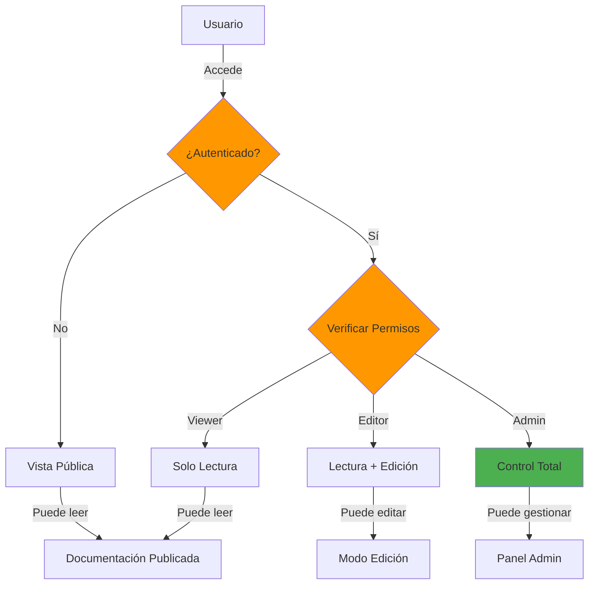

---

### 2. Flujo de Edición de Documento (POC)

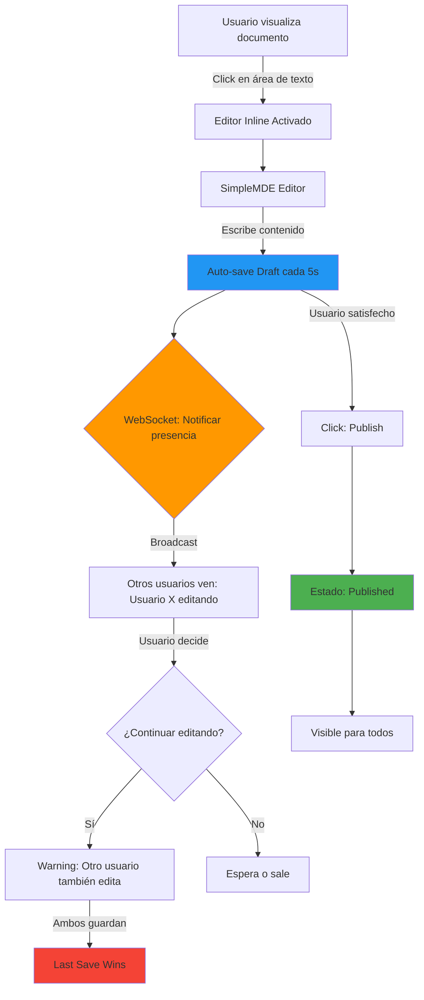

---

### 3. Flujo de Estados del Documento (POC Simplificado)

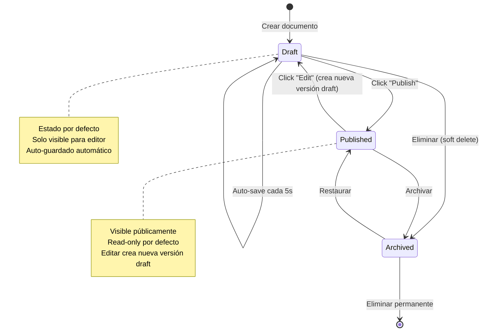

---

### 4. Flujo de Estados con Review (v0.5 - Futuro)

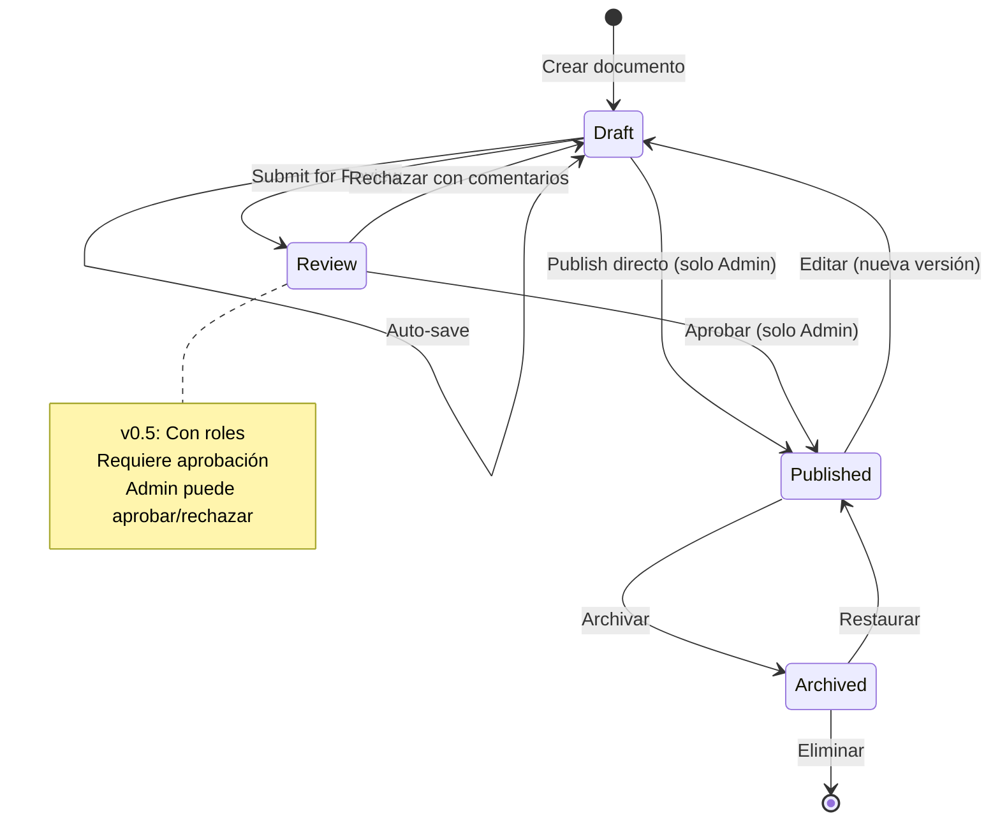

---

### 5. Flujo de Multi-usuario con Presencia (POC)

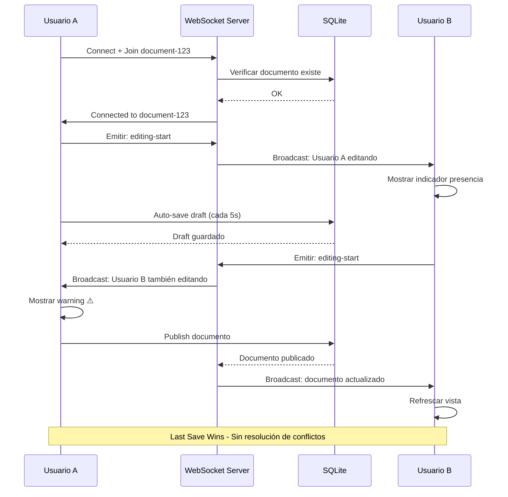

---

### 6. Flujo de Búsqueda (POC con FTS5)

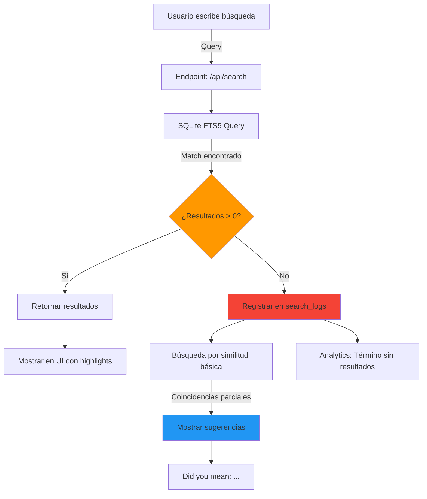

---

### 7. Flujo de Navegación Híbrida

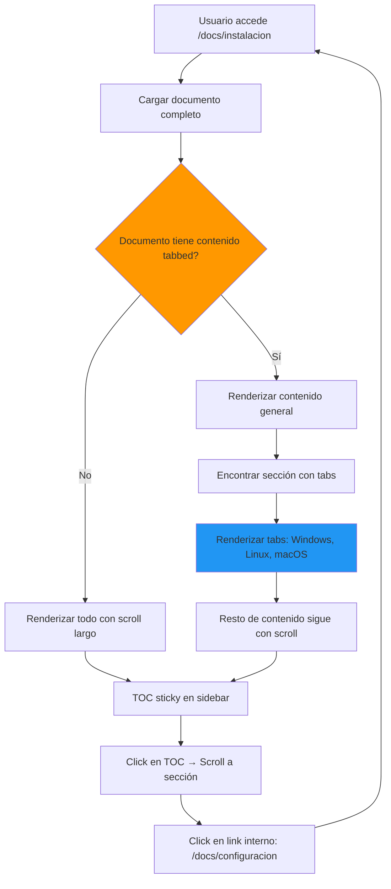

---

### 8. Flujo de Carga de Imágenes

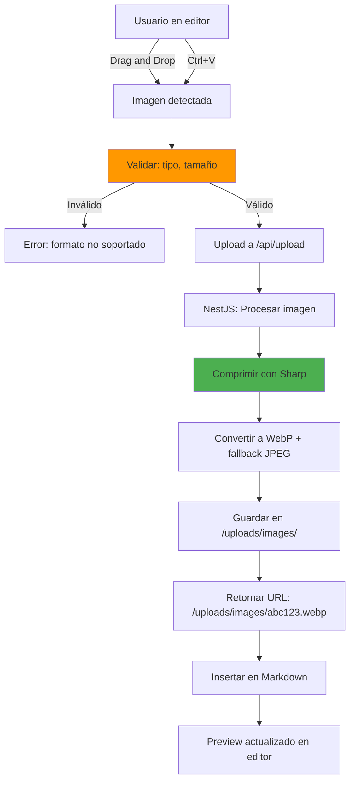

---

### 9. Flujo de Rendering de Contenido Markdown

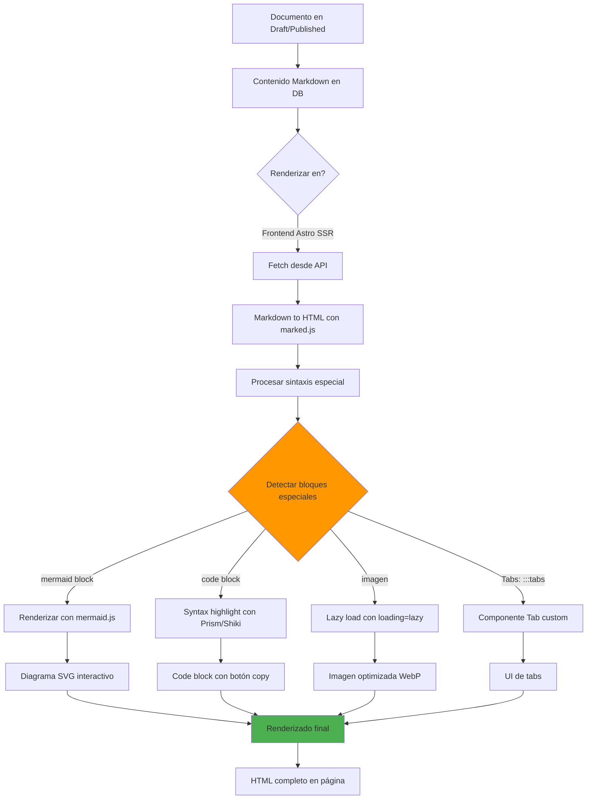

---

### 10. Flujo de Analytics y Tracking (POC Simple)

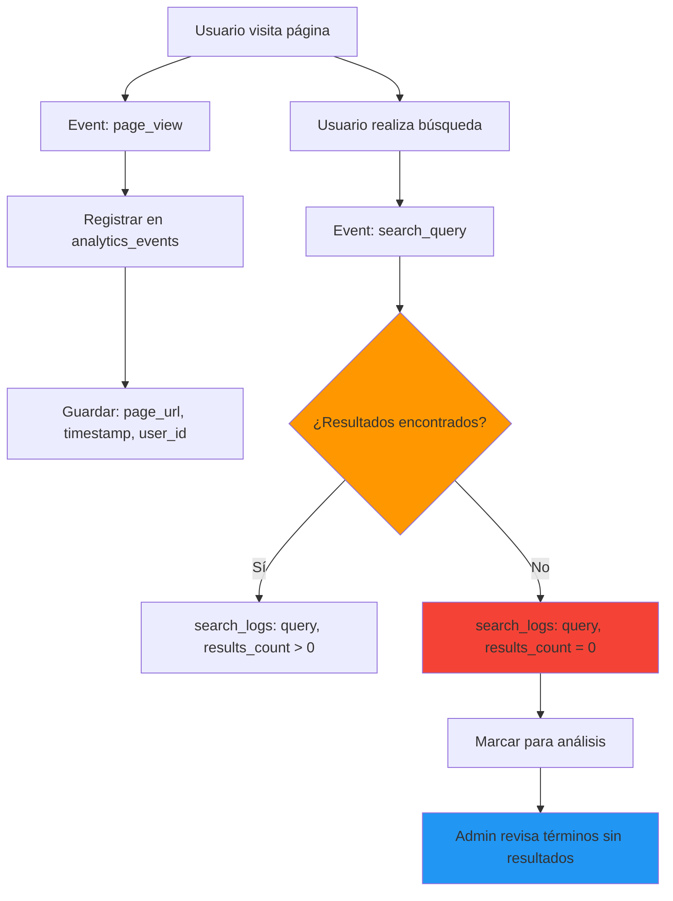

---

### 11. Flujo de Comunicación Astro ↔ NestJS

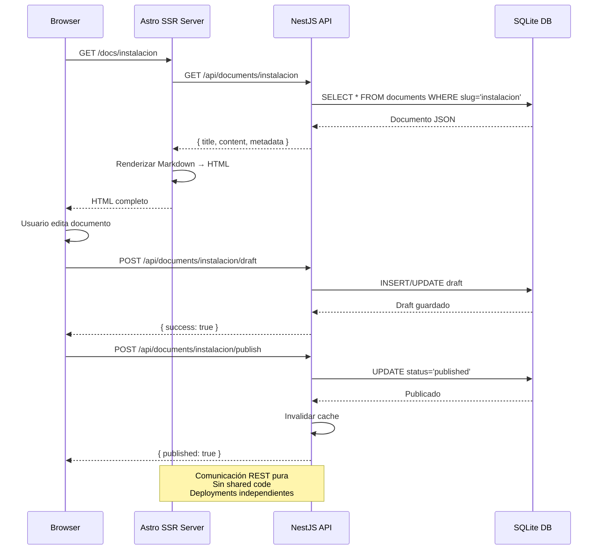

---

### 12. Flujo de Versionado (Futuro v0.5)

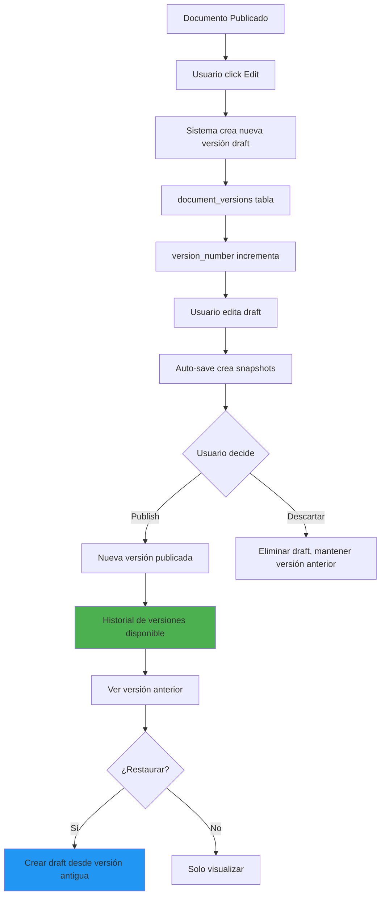

---

## 📊 **ARQUITECTURA DE ALTO NIVEL**

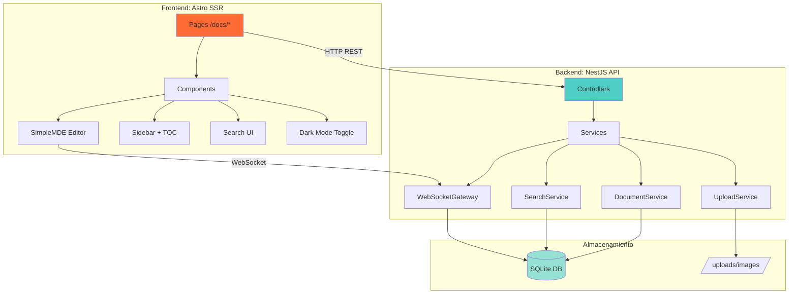

---

## 🎯 **DECISIONES TÉCNICAS CLAVE**

### ✅ **Arquitectura Validada**

1. **Separación limpia**: Astro + NestJS sin monorepo
2. **Comunicación**: REST API + WebSocket para presencia
3. **Base de datos**: SQLite con FTS5 para búsqueda
4. **Editor**: SimpleMDE (inline básico) → TipTap (v2.0)
5. **Multi-usuario**: Presencia WebSocket → Collaboration (v2.0)
6. **Estados**: Draft → Published (POC) → +Review (v0.5)
7. **Storage**: Local filesystem → Opción externa (futuro)
8. **Timeline**: 5-6 semanas POC → Iteraciones incrementales

---

## 🚀 **PRÓXIMO PASO**

Con estos flujos validados, ahora crearemos:

1. ✅ **ARCHITECTURE.md** para cada proyecto
2. ✅ **Tech Stack** detallado con justificaciones
3. ✅ **Estructura de carpetas** completa
4. ✅ **Esquemas de base de datos** SQL
5. ✅ **Contratos de API REST** OpenAPI-style
6. ✅ **Roadmap de implementación** POC → v0.5 → v1.0 → v2.0
7. ✅ **Guía de setup inicial** con comandos

---

**📝 Nota:** Todos los flujos están diseñados para implementación incremental. POC tendrá lo esencial, versiones posteriores agregarán complejidad según validación de uso real.
