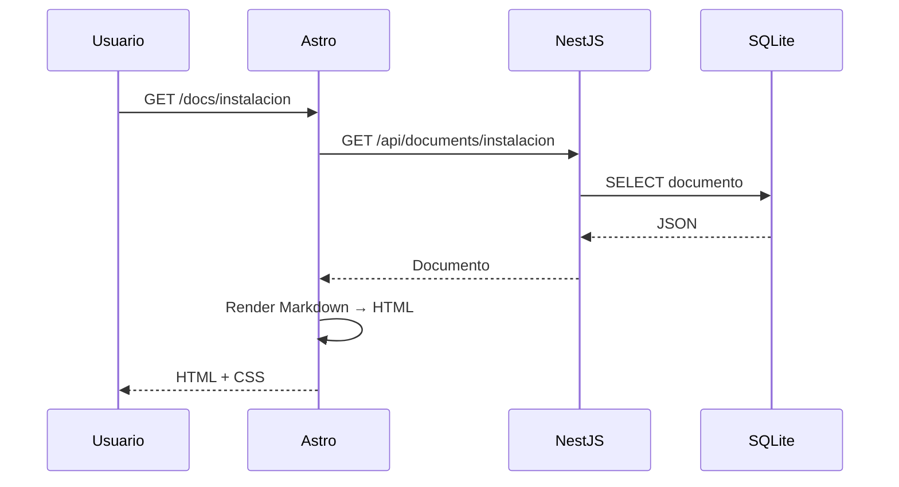
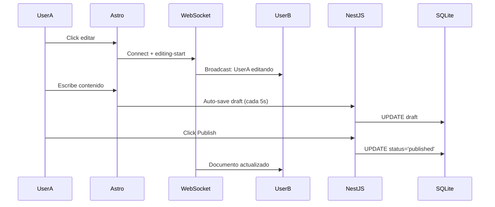

# 📋 Resumen Ejecutivo - Decisiones y Arquitectura

**Proyecto**: Framework de Documentación  
**Fecha**: 17 de noviembre, 2025  
**Estado**: Decisiones finalizadas - Listo para implementación

---

## 🎯 **VISIÓN DEL PROYECTO**

Sistema de documentación colaborativo con edición en tiempo real, inspirado en Obsidian, construido con arquitectura separada:

- **Frontend**: Astro SSR (Puerto 4321)
- **Backend**: NestJS API + WebSocket (Puerto 3000)
- **Base de datos**: SQLite con FTS5
- **Timeline**: POC 5-6 semanas → Iteraciones incrementales

---

## ✅ **DECISIONES CLAVE TOMADAS**

### 🔴 **Decisiones Críticas**

| Aspecto           | Decisión POC                                 | Justificación                                   | Futuro                       |
| ----------------- | -------------------------------------------- | ----------------------------------------------- | ---------------------------- |
| **Multi-usuario** | Real-time Simplificado (WebSocket presencia) | 1 semana vs 3-4 semanas de real-time completo   | v2.0: Collaboration completa |
| **Editor**        | Inline Básico (SimpleMDE/EasyMDE)            | 2 semanas vs 3-4 de TipTap avanzado             | v2.0: TipTap/ProseMirror     |
| **Navegación**    | Híbrida: Scroll largo + Tabs opcionales      | Flexibilidad para diferentes tipos de contenido | Mantener                     |
| **Review State**  | Sin Review en POC (Draft → Published)        | Simplificar flujo inicial                       | v0.5: Agregar con roles      |
| **Timeline**      | POC 5-6 semanas con features básicas         | Validar idea rápidamente                        | Iterar según feedback        |

### 🟡 **Decisiones Importantes**

| Categoría              | Tecnología/Enfoque      | Razón                                                 |
| ---------------------- | ----------------------- | ----------------------------------------------------- |
| **Frontend Framework** | Astro SSR               | Performance, Islands Architecture, SEO                |
| **Backend Framework**  | NestJS                  | TypeScript, modular, WebSocket nativo                 |
| **Base de datos**      | SQLite + FTS5           | Sin servidor, búsqueda integrada, suficiente para POC |
| **Editor**             | SimpleMDE → TipTap (v2) | Rápido setup inicial, migración futura                |
| **WebSocket**          | Socket.io               | Confiable, bien soportado                             |
| **Image Processing**   | Sharp                   | Rápido, WebP/AVIF support                             |
| **Markdown Parser**    | marked.js               | Simple, extensible                                    |
| **Syntax Highlight**   | Shiki                   | Temas VS Code, preciso                                |

---

## 🏗️ **ARQUITECTURA RESUMIDA**

### **Flujo Principal**

```
┌─────────┐
│ Browser │
└────┬────┘
     │ HTTP + WebSocket
     │
┌────▼──────────────────────────┐
│  Astro SSR (Frontend)         │
│  - Pages: /docs/[slug]        │
│  - SimpleMDE Editor           │
│  - Sidebar + TOC              │
└────┬──────────────────────────┘
     │ REST API
     │
┌────▼──────────────────────────┐
│  NestJS API (Backend)         │
│  - REST Controllers           │
│  - WebSocket Gateway          │
│  - Services                   │
└────┬──────────────────────────┘
     │
┌────▼──────────────────────────┐
│  SQLite + File System         │
│  - documents.db (FTS5)        │
│  - /uploads/images/           │
└───────────────────────────────┘
```

### **Componentes Core**

#### Frontend (Astro)

```
src/
├── components/
│   ├── editor/SimpleMDEditor.tsx
│   ├── layout/Sidebar.astro
│   ├── layout/TOC.astro
│   └── search/SearchBar.tsx
├── pages/
│   └── docs/[...slug].astro
├── lib/
│   ├── api.ts
│   └── websocket.ts
└── styles/
    ├── global.css
    └── themes/
```

#### Backend (NestJS)

```
src/
├── modules/
│   ├── documents/
│   │   ├── documents.controller.ts
│   │   ├── documents.service.ts
│   │   └── documents.gateway.ts
│   ├── search/search.service.ts
│   ├── upload/upload.service.ts
│   └── analytics/analytics.service.ts
└── database/
    └── migrations/
```

---

## 📊 **ESQUEMA DE BASE DE DATOS**

### **POC (Simple)**

```sql
-- Documentos
documents (
  id, slug, title, content,
  status: 'draft' | 'published' | 'archived',
  created_at, updated_at, created_by
)

-- Búsqueda Full-Text
documents_fts (FTS5: title, content)

-- Analytics
analytics_events (
  event_type: 'page_view' | 'search_query',
  metadata, timestamp
)

-- Búsquedas sin resultados
search_logs (query, results_count, searched_at)
```

---

## 🔄 **FLUJOS PRINCIPALES**

### 1. **Lectura de Documento (SSR)**



### 2. **Edición con Presencia**



### 3. **Búsqueda FTS5**

```mermaid
graph LR
    A[Usuario busca] --> B[/api/search]
    B --> C[SQLite FTS5]
    C --> D{Resultados?}
    D -->|Sí| E[Mostrar resultados]
    D -->|No| F[Log sin resultados]
    F --> G[Sugerencias similares]
```

---

## 🎨 **FEATURES POR VERSIÓN**

### **POC (v0.1) - 5-6 semanas**

✅ **Core Funcional**

- Editor inline básico (SimpleMDE)
- Auto-save drafts cada 5s
- Publish manual
- WebSocket presencia (quién está editando)
- Búsqueda FTS5 básica
- Upload imágenes + optimización (Sharp → WebP)
- Navegación híbrida (scroll + tabs)
- Sidebar colapsable
- TOC sticky
- Dark mode
- Analytics básico (logs)

❌ **No incluido**

- Sistema de Review
- Roles y permisos
- Versionado de documentos
- Real-time text sync
- Búsqueda semántica
- Dashboard analytics

---

### **v0.5 - +2-3 semanas**

🔄 **Mejoras UX**

- Editor inline mejorado
- Sistema de Review (Draft → Review → Published)
- Roles básicos (can_publish flag)
- Versionado de documentos (historial)
- Búsqueda con sugerencias "Did you mean...?"
- Dashboard analytics interno

---

### **v1.0 - +3-4 semanas**

🚀 **Production Ready**

- Editor avanzado (TipTap/ProseMirror)
- Real-time text collaboration (CRDT)
- RBAC completo (admin, editor, viewer)
- Performance optimizations
- Cache strategy avanzada
- Health checks y monitoring

---

### **v2.0 - Futuro**

🌐 **Enterprise Features**

- Multi-idioma (i18n)
- Búsqueda semántica con embeddings
- OAuth providers (Microsoft, Google)
- CDN para assets
- Multi-proyecto
- API pública con rate limiting avanzado

---

## 🛠️ **TECH STACK COMPLETO**

### **Frontend**

| Tecnología       | Versión | Propósito                |
| ---------------- | ------- | ------------------------ |
| Astro            | ^4.0.0  | SSR framework            |
| React            | ^18.2.0 | Componentes interactivos |
| SimpleMDE        | ^1.11.2 | Editor Markdown          |
| marked           | ^11.0.0 | Markdown parser          |
| Shiki            | ^1.0.0  | Syntax highlighting      |
| Mermaid.js       | ^10.6.0 | Diagramas                |
| Socket.io-client | ^4.7.0  | WebSocket                |
| Nanostores       | ^0.10.0 | State management         |
| Tailwind CSS     | ^3.4.0  | Styling                  |

### **Backend**

| Tecnología      | Versión | Propósito        |
| --------------- | ------- | ---------------- |
| NestJS          | ^10.0.0 | API framework    |
| better-sqlite3  | ^9.2.0  | SQLite driver    |
| Kysely          | ^0.27.0 | Query builder    |
| Socket.io       | ^4.7.0  | WebSocket server |
| Sharp           | ^0.33.0 | Image processing |
| Multer          | ^1.4.5  | File uploads     |
| class-validator | ^0.14.0 | DTO validation   |
| Helmet          | ^7.1.0  | Security headers |

---

## 📈 **ROADMAP DE IMPLEMENTACIÓN**

### **Sprint 1 (Semana 1-2): Fundamentos**

#### Backend

- [ ] Setup proyecto NestJS
- [ ] Configurar SQLite + Kysely
- [ ] Migrations: documents, FTS5, analytics
- [ ] API CRUD documentos
- [ ] WebSocket Gateway básico
- [ ] Testing unitario

#### Frontend

- [ ] Setup proyecto Astro
- [ ] Layout base + estilos
- [ ] Página `/docs/[slug]` SSR
- [ ] Markdown rendering (marked + Shiki)
- [ ] Cliente API REST

**Entregable**: Lectura de documentación funcional

---

### **Sprint 2 (Semana 3-4): Edición**

#### Backend

- [ ] Endpoint saveDraft con auto-save
- [ ] Endpoint publish
- [ ] WebSocket presencia (editing-start/stop)
- [ ] Búsqueda FTS5
- [ ] Upload controller + Sharp optimization

#### Frontend

- [ ] Integrar SimpleMDE
- [ ] Auto-save cada 5s
- [ ] Botón Publish
- [ ] WebSocket client (presencia)
- [ ] Search bar con resultados
- [ ] Image upload drag & drop

**Entregable**: Edición y búsqueda funcionales

---

### **Sprint 3 (Semana 5-6): Polish**

#### Backend

- [ ] Analytics service
- [ ] Log búsquedas sin resultados
- [ ] Rate limiting
- [ ] CORS configurado
- [ ] Documentation API

#### Frontend

- [ ] Sidebar navegación
- [ ] TOC sticky generado automáticamente
- [ ] Dark mode toggle
- [ ] Tabs para contenido
- [ ] Responsive mobile
- [ ] Mermaid diagrams
- [ ] Copy button en code blocks

**Entregable**: POC completo y pulido

---

## 📊 **MÉTRICAS DE ÉXITO**

### **POC (Validación)**

- ✅ Crear y editar documentos
- ✅ Auto-save funciona sin pérdida
- ✅ Presencia de usuarios visible
- ✅ Búsqueda encuentra contenido
- ✅ Imágenes se suben y optimizan
- ✅ UI responsiva y accesible
- ✅ Dark mode funciona
- ✅ Performance < 2s carga inicial

### **v0.5 (Adopción)**

- ✅ 10+ documentos reales migrados
- ✅ 3+ usuarios activos diarios
- ✅ Review workflow en uso
- ✅ 0 bugs críticos en producción

### **v1.0 (Producción)**

- ✅ 100+ documentos
- ✅ 20+ usuarios activos
- ✅ Real-time collaboration estable
- ✅ 99.5% uptime
- ✅ < 1s tiempo de respuesta API

---

## 🔐 **SEGURIDAD**

### **POC**

```typescript
// Rate limiting básico
@UseGuards(ThrottlerGuard)
@Throttle(100, 60) // 100 req/min

// CORS
app.enableCors({
  origin: ['http://localhost:4321']
});

// Validación inputs
@IsString()
@MaxLength(10000)
content: string;
```

### **v1.0**

- Helmet.js (security headers)
- JWT authentication
- RBAC con roles
- CSRF protection
- Input sanitization
- Audit logs
- Rate limiting por usuario

---

## 📚 **DOCUMENTACIÓN TÉCNICA**

### **Docs Creados**

1. ✅ [ARCHITECTURE.md](./ARCHITECTURE.md) - Arquitectura general
2. ✅ [docs/FRONTEND_ARCHITECTURE.md](./docs/FRONTEND_ARCHITECTURE.md) - Astro detallado
3. ✅ [docs/BACKEND_ARCHITECTURE.md](./docs/BACKEND_ARCHITECTURE.md) - NestJS detallado
4. ✅ [docs/FLUJOS_SISTEMA.md](./docs/FLUJOS_SISTEMA.md) - Diagramas Mermaid
5. ✅ [docs/RESUMEN_DECISIONES.md](./docs/RESUMEN_DECISIONES.md) - Este documento

### **Docs Pendientes**

- [ ] API_CONTRACTS.md - Especificación OpenAPI
- [ ] SETUP_GUIDE.md - Instalación paso a paso
- [ ] CONTRIBUTING.md - Guía para contribuidores
- [ ] DEPLOYMENT.md - Guía de deployment K8s

---

## 🚀 **COMANDOS RÁPIDOS**

### **Desarrollo Local**

```bash
# Backend
cd docs-backend
npm install
npm run dev # Puerto 3000

# Frontend (terminal separado)
cd docs-frontend
npm install
npm run dev # Puerto 4321

# Abrir navegador
http://localhost:4321
```

### **Testing**

```bash
# Backend
npm run test
npm run test:e2e

# Frontend
npm run test
```

### **Build Producción**

```bash
# Backend
npm run build
npm run start:prod

# Frontend
npm run build
npm run preview
```

---

## 🎯 **PRÓXIMOS PASOS INMEDIATOS**

1. ✅ **Revisar y aprobar decisiones** - COMPLETADO
2. ✅ **Documentar arquitectura** - COMPLETADO
3. ⏳ **Crear proyectos iniciales**
   - Setup NestJS con estructura de carpetas
   - Setup Astro con estructura de carpetas
4. ⏳ **Configurar base de datos**
   - SQLite + Kysely
   - Ejecutar migrations iniciales
5. ⏳ **Implementar Sprint 1**
   - API CRUD básico
   - SSR de documentos

---

## 📞 **EQUIPO Y CONTACTO**

- **Project Lead**: [Tu nombre]
- **Timeline**: POC en 5-6 semanas
- **Stack**: Astro + NestJS + SQLite
- **Repositorio**: [GitHub URL]

---

**Última actualización**: 17 de noviembre, 2025  
**Versión**: 1.0.0  
**Estado**: ✅ Listo para iniciar desarrollo
