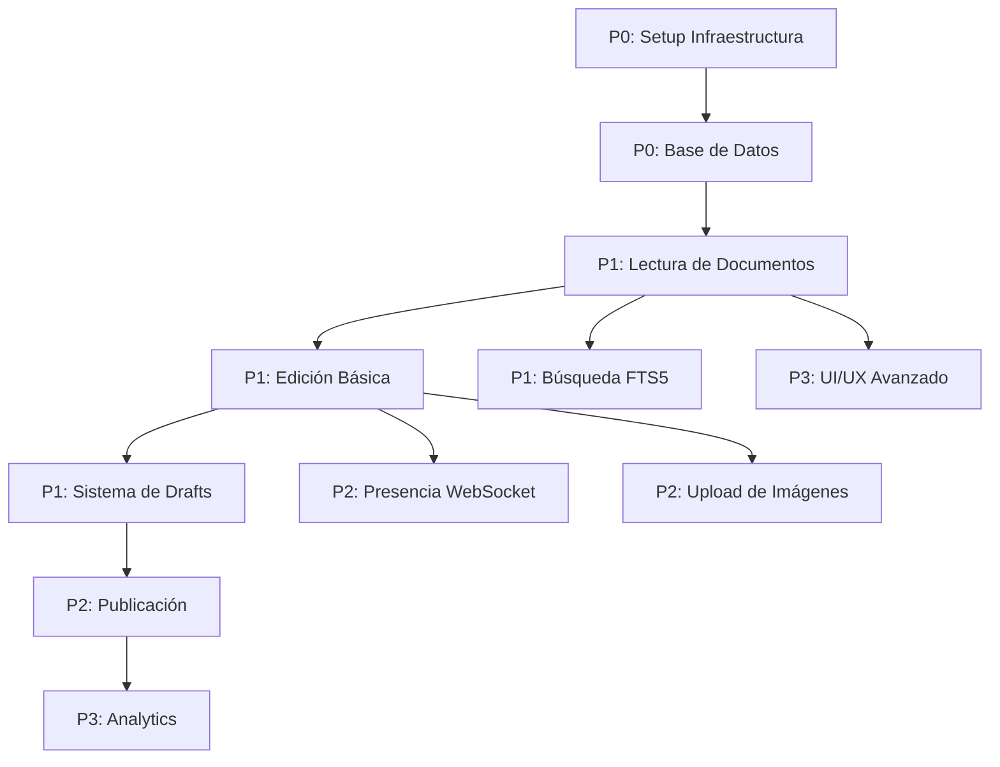

# 🗓️ Roadmap - Priorización por Features

**Proyecto**: Documentation Framework  
**Stack**: Astro + NestJS + Prisma + SQLite  
**Fecha**: 17 de noviembre, 2025

---

## 📋 **FILOSOFÍA DE PRIORIZACIÓN**

### **Criterios de Prioridad**

| Prioridad | Criterio | Descripción                                           |
| --------- | -------- | ----------------------------------------------------- |
| **P0**    | Crítico  | Sin esto, el sistema no funciona. Bloqueante.         |
| **P1**    | Alta     | Core feature del sistema. Valor inmediato al usuario. |
| **P2**    | Media    | Mejora experiencia pero no es crítico.                |
| **P3**    | Baja     | Nice-to-have. Se puede posponer.                      |

### **Dependencias**



---

## 🎯 **PRIORIDAD 0 - CRÍTICO (Infraestructura)**

### **P0.1: Setup Backend**

**Objetivo**: Backend funcional mínimo con NestJS + Prisma

**Tareas**:

- [ ] Inicializar proyecto NestJS
- [ ] Configurar TypeScript + ESLint
- [ ] Instalar dependencias core
- [ ] Configurar estructura de carpetas feature-based
- [ ] Setup de scripts npm
- [ ] Configurar variables de entorno

**Dependencias**: Ninguna  
**Bloqueante para**: Todo el backend  
**Estimación**: 2-3 horas

---

### **P0.2: Setup Prisma + Base de Datos**

**Objetivo**: Database operacional con schema y migraciones

**Tareas**:

- [ ] Inicializar Prisma con SQLite
- [ ] Crear schema de `Document`
- [ ] Crear migración inicial
- [ ] Configurar `PrismaService` global
- [ ] Crear seed básico (3 documentos)
- [ ] Verificar con Prisma Studio

**Dependencias**: P0.1  
**Bloqueante para**: Todos los features de backend  
**Estimación**: 3-4 horas

---

### **P0.3: Setup Frontend**

**Objetivo**: Frontend Astro SSR operacional

**Tareas**:

- [ ] Inicializar proyecto Astro
- [ ] Configurar SSR mode
- [ ] Configurar React integration
- [ ] Instalar dependencias core
- [ ] Configurar estructura de carpetas feature-based
- [ ] Setup Tailwind CSS
- [ ] Configurar variables de entorno

**Dependencias**: Ninguna  
**Bloqueante para**: Todo el frontend  
**Estimación**: 2-3 horas

---

### **P0.4: Infraestructura Global Backend**

**Objetivo**: Middleware, guards, filters configurados

**Tareas**:

- [ ] Configurar `main.ts` (CORS, validation, helmet)
- [ ] Crear `LoggingInterceptor`
- [ ] Crear `TransformInterceptor`
- [ ] Crear `HttpExceptionFilter`
- [ ] Configurar rate limiting (Throttler)
- [ ] Crear configs (`app.config.ts`, `database.config.ts`)

**Dependencias**: P0.1, P0.2  
**Bloqueante para**: API Controllers  
**Estimación**: 3-4 horas

---

### **P0.5: Shared Services Frontend**

**Objetivo**: API client y WebSocket client base

**Tareas**:

- [ ] Crear `api.service.ts` (Axios wrapper)
- [ ] Crear `websocket.service.ts` (Socket.io wrapper)
- [ ] Crear `storage.service.ts` (LocalStorage wrapper)
- [ ] Configurar interceptors de error
- [ ] Crear tipos base (`api-response.type.ts`)

**Dependencias**: P0.3  
**Bloqueante para**: Todos los features de frontend  
**Estimación**: 2-3 horas

---

## 🔥 **PRIORIDAD 1 - ALTA (Core Features)**

### **P1.1: Lectura de Documentos**

**Objetivo**: Ver documentos publicados (SSR)

**Backend**:

- [ ] `Document` entity y repository
- [ ] `DocumentsService.findAll()`
- [ ] `DocumentsService.findBySlug()`
- [ ] `GET /documents` controller
- [ ] `GET /documents/:slug` controller
- [ ] Tests unitarios

**Frontend**:

- [ ] `documents.service.ts`
- [ ] `document.type.ts`
- [ ] `DocumentViewer.astro` component
- [ ] `DocumentList.astro` component
- [ ] `/docs/[...slug].astro` page
- [ ] `/docs/index.astro` page

**Dependencias**: P0.2, P0.4, P0.5  
**Valor de Negocio**: ⭐⭐⭐⭐⭐ (sin esto no hay documentación)  
**Estimación**: 6-8 horas

---

### **P1.2: Renderizado de Markdown**

**Objetivo**: Contenido Markdown renderizado con syntax highlighting

**Frontend**:

- [ ] `markdown.service.ts` (marked.js + Shiki)
- [ ] Configurar renderer custom
- [ ] `MarkdownRenderer.astro` component
- [ ] `CodeBlock.astro` con copy button
- [ ] Estilos CSS para markdown
- [ ] Soporte para headings con anchors

**Dependencias**: P1.1  
**Valor de Negocio**: ⭐⭐⭐⭐⭐ (core del sistema)  
**Estimación**: 5-6 horas

---

### **P1.3: Creación de Documentos**

**Objetivo**: Crear nuevos documentos (drafts)

**Backend**:

- [ ] `CreateDocumentDto` con validación
- [ ] `DocumentsService.create()`
- [ ] Generación de slug automático
- [ ] Validación de slug único
- [ ] `POST /documents` controller
- [ ] Tests unitarios

**Frontend**:

- [ ] `documents.service.create()`
- [ ] Formulario de creación
- [ ] Validación en frontend
- [ ] Redirección a editor

**Dependencias**: P1.1  
**Valor de Negocio**: ⭐⭐⭐⭐⭐ (bloqueante para edición)  
**Estimación**: 4-5 horas

---

### **P1.4: Editor Markdown Básico**

**Objetivo**: Editar documentos con SimpleMDE

**Frontend**:

- [ ] Instalar SimpleMDE
- [ ] `SimpleMDEditor.tsx` component
- [ ] Configurar toolbar
- [ ] Integración con API
- [ ] Estilos CSS custom
- [ ] Manejo de estado local

**Backend**:

- [ ] `UpdateDocumentDto` con validación
- [ ] `DocumentsService.saveDraft()`
- [ ] `PUT /documents/:id/draft` controller

**Dependencias**: P1.3  
**Valor de Negocio**: ⭐⭐⭐⭐⭐ (core del sistema)  
**Estimación**: 6-8 horas

---

### **P1.5: Auto-Save de Drafts**

**Objetivo**: Guardar cambios automáticamente cada 5 segundos

**Frontend**:

- [ ] `editor.store.ts` (Nanostores)
- [ ] Lógica de auto-save con debounce
- [ ] Indicador visual "Guardando..."
- [ ] Timestamp de último guardado
- [ ] Manejo de errores de red

**Backend**:

- [ ] Optimizar `PUT /documents/:id/draft`
- [ ] Manejo de concurrencia

**Dependencias**: P1.4  
**Valor de Negocio**: ⭐⭐⭐⭐ (mejora UX crítica)  
**Estimación**: 3-4 horas

---

### **P1.6: Búsqueda Full-Text**

**Objetivo**: Buscar documentos con SQLite FTS5

**Backend**:

- [ ] Crear migración FTS5
- [ ] Crear triggers de sincronización
- [ ] `FTS5Repository` con raw SQL
- [ ] `SearchService.search()`
- [ ] `GET /search` controller
- [ ] Logging de búsquedas en `SearchLog`

**Frontend**:

- [ ] `search.service.ts`
- [ ] `SearchBar.tsx` component
- [ ] `SearchResults.tsx` component
- [ ] `/search.astro` page
- [ ] Highlight de términos
- [ ] Debounce en input

**Dependencias**: P0.2, P1.1  
**Valor de Negocio**: ⭐⭐⭐⭐⭐ (core feature)  
**Estimación**: 6-8 horas

---

## 🚀 **PRIORIDAD 2 - MEDIA (Mejoras de Experiencia)**

### **P2.1: Publicación de Documentos**

**Objetivo**: Cambiar estado de DRAFT a PUBLISHED

**Backend**:

- [ ] `DocumentsService.publish()`
- [ ] Validación de contenido no vacío
- [ ] `PUT /documents/:id/publish` controller
- [ ] Tests unitarios

**Frontend**:

- [ ] Botón "Publicar" en editor
- [ ] Modal de confirmación
- [ ] Redirección a vista publicada
- [ ] Manejo de errores

**Dependencias**: P1.5  
**Valor de Negocio**: ⭐⭐⭐⭐ (workflow completo)  
**Estimación**: 2-3 horas

---

### **P2.2: Presencia en Tiempo Real (WebSocket)**

**Objetivo**: Ver quién más está editando un documento

**Backend**:

- [ ] `PresenceGateway` (Socket.io)
- [ ] Events: `editing-start`, `editing-stop`
- [ ] Tracking de usuarios activos
- [ ] Namespace `/presence`
- [ ] Manejo de desconexiones

**Frontend**:

- [ ] `presence.service.ts`
- [ ] Conectar al editar documento
- [ ] `PresenceIndicator.tsx` component
- [ ] Mostrar avatares/nombres
- [ ] Desconectar al salir

**Dependencias**: P1.4, P0.5  
**Valor de Negocio**: ⭐⭐⭐⭐ (colaboración)  
**Estimación**: 5-6 horas

---

### **P2.3: Upload de Imágenes**

**Objetivo**: Subir imágenes y obtener URL optimizada

**Backend**:

- [ ] Configurar Multer
- [ ] `UploadService.uploadImage()`
- [ ] `ImageProcessor` con Sharp (WebP)
- [ ] `StorageService` para file system
- [ ] `POST /upload/image` controller
- [ ] Validación de formato y tamaño
- [ ] Crear carpetas `uploads/images/`

**Frontend**:

- [ ] `upload.service.ts`
- [ ] `ImageUploader.tsx` component
- [ ] Drag & drop
- [ ] Preview de imagen
- [ ] Progress bar
- [ ] Insertar en editor

**Dependencias**: P1.4  
**Valor de Negocio**: ⭐⭐⭐ (útil pero no crítico)  
**Estimación**: 6-8 horas

---

### **P2.4: Sidebar de Navegación**

**Objetivo**: Navegación lateral con estructura de documentos

**Frontend**:

- [ ] `Sidebar.astro` component
- [ ] Obtener lista de documentos
- [ ] Árbol de navegación (flat o categorías)
- [ ] Highlight de página actual
- [ ] Responsive (colapsable en mobile)
- [ ] Estado persistente (localStorage)

**Dependencias**: P1.1  
**Valor de Negocio**: ⭐⭐⭐⭐ (navegación esencial)  
**Estimación**: 4-5 horas

---

### **P2.5: Table of Contents (TOC)**

**Objetivo**: TOC sticky con anchors a headings

**Frontend**:

- [ ] `TOC.astro` component
- [ ] Parsear headings del contenido
- [ ] Generar anchors automáticos
- [ ] Sticky positioning
- [ ] Highlight de sección activa (IntersectionObserver)
- [ ] Smooth scroll

**Dependencias**: P1.2  
**Valor de Negocio**: ⭐⭐⭐ (mejora navegación)  
**Estimación**: 3-4 horas

---

### **P2.6: Dark Mode**

**Objetivo**: Toggle entre tema claro y oscuro

**Frontend**:

- [ ] `theme.store.ts` (Nanostores)
- [ ] CSS variables para ambos temas
- [ ] `ThemeToggle.tsx` component
- [ ] Persistencia en localStorage
- [ ] Sincronización con preferencias del sistema
- [ ] Transiciones suaves

**Dependencias**: P0.3  
**Valor de Negocio**: ⭐⭐⭐ (mejora UX)  
**Estimación**: 3-4 horas

---

### **P2.7: Archivar Documentos**

**Objetivo**: Soft delete de documentos

**Backend**:

- [ ] `DocumentsService.archive()`
- [ ] Cambiar estado a ARCHIVED
- [ ] `DELETE /documents/:id` controller
- [ ] Excluir archivados de búsquedas

**Frontend**:

- [ ] Botón "Archivar"
- [ ] Modal de confirmación
- [ ] Redirección a listado
- [ ] Filtro para ver archivados (admin)

**Dependencias**: P2.1  
**Valor de Negocio**: ⭐⭐ (gestión de contenido)  
**Estimación**: 2-3 horas

---

## 📊 **PRIORIDAD 3 - BAJA (Nice-to-Have)**

### **P3.1: Analytics Básico**

**Objetivo**: Tracking de eventos básicos

**Backend**:

- [ ] `AnalyticsEvent` entity y repository
- [ ] `AnalyticsService.track()`
- [ ] `POST /analytics/track` controller
- [ ] Event types: page_view, search_query, document_edit

**Frontend**:

- [ ] `analytics.service.ts`
- [ ] Track page views automático
- [ ] Track búsquedas
- [ ] Track ediciones
- [ ] Envío en background

**Dependencias**: P0.2, P1.1  
**Valor de Negocio**: ⭐⭐ (datos para futuro)  
**Estimación**: 3-4 horas

---

### **P3.2: Búsqueda con Sugerencias**

**Objetivo**: Autocompletado al buscar

**Backend**:

- [ ] Endpoint para sugerencias
- [ ] Top queries del `SearchLog`
- [ ] Ranking por frecuencia

**Frontend**:

- [ ] `SearchSuggestions.tsx` component
- [ ] Dropdown con sugerencias
- [ ] Navegación con teclado
- [ ] Highlight de match

**Dependencias**: P1.6  
**Valor de Negocio**: ⭐⭐ (mejora búsqueda)  
**Estimación**: 4-5 horas

---

### **P3.3: Preview de Documento**

**Objetivo**: Vista previa sin publicar

**Backend**:

- [ ] `GET /documents/:id/preview` controller
- [ ] Permitir ver drafts con token temporal

**Frontend**:

- [ ] Botón "Preview" en editor
- [ ] Abrir en nueva pestaña
- [ ] Modo preview (no editable)
- [ ] Banner indicando "Vista Previa"

**Dependencias**: P1.5  
**Valor de Negocio**: ⭐⭐ (útil para revisar)  
**Estimación**: 2-3 horas

---

### **P3.4: Diagramas Mermaid**

**Objetivo**: Renderizar diagramas desde código

**Frontend**:

- [ ] Instalar Mermaid.js
- [ ] `MermaidDiagram.tsx` component
- [ ] Detectar bloques ```mermaid
- [ ] Renderizar en cliente
- [ ] Manejo de errores de sintaxis

**Dependencias**: P1.2  
**Valor de Negocio**: ⭐⭐ (nice-to-have)  
**Estimación**: 3-4 horas

---

### **P3.5: Historial de Cambios (Simple)**

**Objetivo**: Ver cuándo se editó por última vez

**Backend**:

- [ ] Usar `updatedAt` de Prisma
- [ ] `GET /documents/:id/history` (metadata)

**Frontend**:

- [ ] Mostrar "Última edición: hace 2 horas"
- [ ] Mostrar "Creado por: admin"
- [ ] Formato de fechas con date-fns

**Dependencias**: P1.1  
**Valor de Negocio**: ⭐ (informativo)  
**Estimación**: 1-2 horas

---

### **P3.6: Metadatos de Documento**

**Objetivo**: Mostrar autor, fechas, tags

**Frontend**:

- [ ] `DocumentMeta.astro` component
- [ ] Mostrar createdAt, updatedAt
- [ ] Mostrar createdBy
- [ ] Tags (si se agregan después)

**Dependencias**: P1.1  
**Valor de Negocio**: ⭐ (mejora visual)  
**Estimación**: 1-2 horas

---

### **P3.7: Responsive Mobile**

**Objetivo**: Optimizar para mobile y tablets

**Frontend**:

- [ ] Media queries para sidebar
- [ ] Navegación mobile (hamburger menu)
- [ ] TOC en modal para mobile
- [ ] Editor responsive
- [ ] Touch gestures

**Dependencias**: P2.4, P2.5  
**Valor de Negocio**: ⭐⭐⭐ (accesibilidad)  
**Estimación**: 6-8 horas

---

### **P3.8: Loading States**

**Objetivo**: Skeletons y spinners

**Frontend**:

- [ ] `Skeleton.astro` component
- [ ] Loading state en listados
- [ ] Loading state en búsqueda
- [ ] Loading state en editor
- [ ] Optimistic updates

**Dependencias**: Todos los P1  
**Valor de Negocio**: ⭐⭐ (mejora UX)  
**Estimación**: 3-4 horas

---

### **P3.9: Error Handling UI**

**Objetivo**: Páginas de error amigables

**Frontend**:

- [ ] `404.astro` page
- [ ] `500.astro` page
- [ ] Error boundary global
- [ ] Toast notifications
- [ ] Retry automático en errores de red

**Dependencias**: P0.3  
**Valor de Negocio**: ⭐⭐ (profesionalismo)  
**Estimación**: 3-4 horas

---

## 📈 **ORDEN SUGERIDO DE IMPLEMENTACIÓN**

### **Fase 1: Fundamentos (8-12 horas)**

1. P0.1 → P0.2 → P0.3 → P0.4 → P0.5

**Resultado**: Infraestructura lista para desarrollar features

---

### **Fase 2: Core Features (22-28 horas)**

2. P1.1 → P1.2 → P1.3 → P1.4 → P1.5 → P1.6

**Resultado**: Sistema funcional con lectura, edición, auto-save y búsqueda

---

### **Fase 3: Publicación y Colaboración (14-18 horas)**

3. P2.1 → P2.2 → P2.4 → P2.5 → P2.6

**Resultado**: Workflow completo + presencia en tiempo real + navegación

---

### **Fase 4: Multimedia y Gestión (10-14 horas)**

4. P2.3 → P2.7 → P3.1

**Resultado**: Upload de imágenes + archivar + analytics básico

---

### **Fase 5: Polish y UX (16-22 horas)**

5. P3.2 → P3.3 → P3.4 → P3.7 → P3.8 → P3.9

**Resultado**: Sistema pulido, responsive, con mejores errores

---

## 🎯 **ESTIMACIONES TOTALES**

| Prioridad | Horas Min | Horas Max | Features |
| --------- | --------- | --------- | -------- |
| **P0**    | 12        | 17        | 5        |
| **P1**    | 27        | 35        | 6        |
| **P2**    | 25        | 33        | 7        |
| **P3**    | 23        | 31        | 9        |
| **TOTAL** | **87h**   | **116h**  | **27**   |

**POC mínimo viable**: P0 + P1 = **39-52 horas** (aprox. 1 semana a tiempo completo)

---

## 🚦 **DECISIÓN POR CONTEXTO**

### **Si tienes 1 semana (40h)**

✅ Implementar: **P0 + P1**  
Resultado: Sistema funcional básico

### **Si tienes 2 semanas (80h)**

✅ Implementar: **P0 + P1 + P2**  
Resultado: Sistema completo con colaboración y navegación

### **Si tienes 3 semanas (120h)**

✅ Implementar: **P0 + P1 + P2 + P3**  
Resultado: Sistema pulido y listo para producción

---

## 🔄 **TRACKING DE PROGRESO**

### **Checklist Rápido**

```markdown
## P0 - Infraestructura

- [ ] P0.1: Setup Backend (2-3h)
- [ ] P0.2: Prisma + Database (3-4h)
- [ ] P0.3: Setup Frontend (2-3h)
- [ ] P0.4: Infraestructura Global Backend (3-4h)
- [ ] P0.5: Shared Services Frontend (2-3h)

## P1 - Core Features

- [ ] P1.1: Lectura de Documentos (6-8h)
- [ ] P1.2: Renderizado Markdown (5-6h)
- [ ] P1.3: Creación de Documentos (4-5h)
- [ ] P1.4: Editor Markdown (6-8h)
- [ ] P1.5: Auto-Save (3-4h)
- [ ] P1.6: Búsqueda FTS5 (6-8h)

## P2 - Mejoras UX

- [ ] P2.1: Publicación (2-3h)
- [ ] P2.2: Presencia WebSocket (5-6h)
- [ ] P2.3: Upload Imágenes (6-8h)
- [ ] P2.4: Sidebar (4-5h)
- [ ] P2.5: TOC (3-4h)
- [ ] P2.6: Dark Mode (3-4h)
- [ ] P2.7: Archivar (2-3h)

## P3 - Nice-to-Have

- [ ] P3.1: Analytics (3-4h)
- [ ] P3.2: Sugerencias Búsqueda (4-5h)
- [ ] P3.3: Preview (2-3h)
- [ ] P3.4: Mermaid (3-4h)
- [ ] P3.5: Historial (1-2h)
- [ ] P3.6: Metadatos (1-2h)
- [ ] P3.7: Responsive (6-8h)
- [ ] P3.8: Loading States (3-4h)
- [ ] P3.9: Error Handling (3-4h)
```

---

## 📚 **RECURSOS**

- [Backend Architecture](./BACKEND_ARCHITECTURE.md)
- [Frontend Architecture](./FRONTEND_ARCHITECTURE.md)
- [API Contracts](./API_CONTRACTS.md)
- [Prisma Schema](./PRISMA_SCHEMA.md)
- [Setup Guide](./SETUP_GUIDE.md)

---

**Última actualización**: 17 de noviembre, 2025  
**Versión**: 1.0.0
